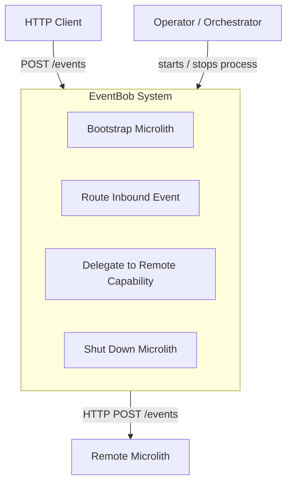
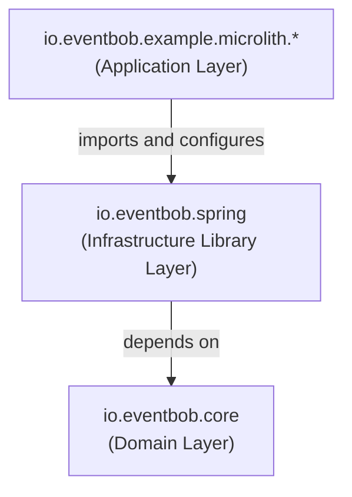
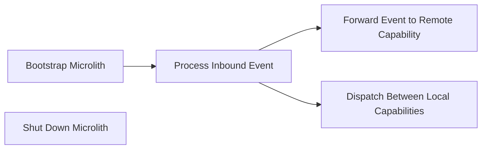

# EventBob

## 1. High Level Architectural Purpose

EventBob is a container framework for bundling multiple microservices into a single deployable process (a microlith) to eliminate the chatty-application anti-pattern caused by excessive inter-microservice network calls. It loads microservice JARs in-process, discovers their declared capabilities, and routes events to them without network overhead. It also supports location transparency: capabilities hosted in remote microliths are registered and routed identically to local ones, so the routing layer is agnostic to handler location.

The system is composed of three Maven modules with a strict inward dependency direction: a framework-agnostic domain core, a reusable Spring Boot infrastructure library, and one or more concrete deployable microlith applications.

---

## 2. Architectural Borders

### Border: Microlith Process

Description: The system boundary is the running microlith process. External actors interact with it over HTTP. The system sends outbound HTTP calls only when delegating to remote capabilities.

Interactors:
- HTTP Client
  - Summary: Any caller that sends events to the microlith for processing.
  - Flow:
    - caller sends HTTP POST to the events endpoint with a wire-format event body
    - the inbound adapter deserialises the body into a domain event
    - the router resolves the target capability name from the event
    - if no handler is registered for the target then an error event is returned
    - if the target is a remote capability then the event is forwarded via HTTP to the remote microlith
    - otherwise the event is delivered to the local handler in-process
    - the handler result is serialised to wire format and returned in the HTTP response
    - on error: if the handler raises a failure the error callback is applied and the error event is returned

- Remote Microlith
  - Summary: A peer microlith that hosts capabilities declared as remote in this microlith's configuration.
  - Flow:
    - the router delivers an event to a remote handler adapter registered under a capability name
    - the adapter converts the domain event to wire format and posts it to the remote endpoint
    - the remote microlith processes the event and returns a wire-format response
    - the adapter converts the wire-format response back to a domain event and returns it to the router
    - on error: HTTP error status or transport exception is surfaced as a handling failure to the caller

- Operator / Orchestrator
  - Summary: Starts and stops the microlith process.
  - Flow:
    - operator starts the process; the application entry point bootstraps the framework runtime
    - the wiring configuration collects all handler sources and initialises them
    - each local capability is registered with the router; each remote capability is registered as an HTTP adapter
    - the inbound HTTP endpoint is bound and the embedded server starts
    - operator stops the process; the framework runtime closes the wiring configuration
    - inline lifecycle holders are shut down in registration order; each releases its resources
    - on error: if a lifecycle initialisation fails the startup aborts and the process exits

---

## 3. Layers

### Layer: Domain Layer — io.eventbob.core

Description: The innermost layer. Defines the domain model, routing abstractions, handler integration contracts, lifecycle contracts, and all handler loading strategies. Carries no framework dependencies. All other modules depend inward on this layer; this layer depends on nothing outside the JDK.

Components:
- Event router: holds the capability-to-handler map, routes events by capability name, executes handlers on virtual threads, exposes itself as a dispatcher.
- Handler integration contract: the single-method contract all capabilities must satisfy; receives a dispatcher for outbound delegation.
- Dispatcher: the outbound-event facility provided to handlers at call time; supports async and sync send semantics.
- Handler loader contract: the loading abstraction whose factory methods hide all concrete implementations; manages resources via a close contract.
- Lifecycle holder contract: the three-phase lifecycle contract (initialise, retrieve, shutdown) for handlers that require dependency injection or resource management.
- Lifecycle context: a context carrier for handler initialisation supplying a configuration map, an optional dispatcher, and an optional framework context.
- Capability marker: a repeatable annotation that binds a handler to one or more capability identifiers.
- Plain handler loader: discovers and instantiates capability handlers from JARs using per-JAR isolation.
- Lifecycle handler loader: loads lifecycle-managed handlers from JARs, coordinates their initialisation, and tracks instances for ordered shutdown.

Inbound Layer Dependencies: io.eventbob.spring, io.eventbob.example.microlith.*
Outbound Layer Dependencies: JDK only

### Layer: Infrastructure Library Layer — io.eventbob.spring

Description: The middle layer. A reusable library that bridges the framework-agnostic core to the Spring Boot runtime. Provides an HTTP server adapter for inbound event processing, an HTTP client adapter for outbound remote-capability delegation, Spring-aware wiring that aggregates multiple handler sources, and a built-in healthcheck capability. Ships no entry point and no hard-coded configuration; all handler sources are provided by the importing application.

Components:
- Wiring configuration: collects inline lifecycle holders, JAR-based lifecycle holders, and remote capability declarations via constructor injection; initialises them; detects duplicates; produces the router bean; tears down lifecycle holders on context close.
- Inbound HTTP endpoint: exposes the events HTTP endpoint; translates wire-format bodies to domain events, delegates to the router, translates results back to wire format.
- Wire transfer object: the anti-corruption DTO for the HTTP boundary; carries serialisation metadata; translates to and from the domain routing envelope; never crosses into core.
- Remote handler adapter: implements the handler integration contract; converts domain events to wire format, posts to a remote endpoint, converts wire-format responses back to domain events.
- Remote loader: implements the handler loader contract; creates one remote handler adapter per remote capability declaration.
- Remote capability declaration: a configuration value object mapping a capability name to a remote endpoint URI.
- Healthcheck handler: a built-in capability registered unconditionally by the wiring configuration.

Inbound Layer Dependencies: io.eventbob.example.microlith.*
Outbound Layer Dependencies: io.eventbob.core

### Layer: Application Layer — io.eventbob.example.microlith.*

Description: The outermost layer. Concrete deployable microlith processes. Each application declares which capabilities to serve locally (via lifecycle holder beans), which to serve remotely (via remote capability declaration beans), and on which port to listen. Contains no domain logic and no infrastructure code — only framework bean declarations and lifecycle holder wiring.

Components:
- Application entry point: declares handler source beans and imports the library wiring configuration; provides the component scan scope for the inbound endpoint.
- Lifecycle holders: fulfil the lifecycle holder contract for each locally-hosted capability; create isolated framework contexts so capabilities share no beans.

Inbound Layer Dependencies: none — this is the outermost layer.
Outbound Layer Dependencies: io.eventbob.spring, io.eventbob.core (lifecycle holder contract, lifecycle context)

---

## 4. Use Cases

### Use Case: Bootstrap Microlith

Description: The process starts; all capability sources are initialised and the HTTP server begins accepting requests.

Scenarios:
- Scenario: all sources available then the framework runtime initialises; lifecycle holders are created and initialised; JAR-based capabilities are loaded; remote capability HTTP adapters are created; the healthcheck is registered; the router is built; the inbound endpoint is bound; the server starts accepting requests.
- Alternate scenario: lifecycle initialisation failure then a lifecycle holder raises an error during initialisation; startup aborts; the process exits without accepting requests.
- Alternate scenario: duplicate capability names across sources then the wiring configuration detects the conflict before building the router; startup aborts.

### Use Case: Process Inbound Event

Description: An HTTP client sends an event to the microlith; the system routes it to the appropriate capability and returns the result.

Scenarios:
- Scenario: known local capability then the inbound adapter translates the wire-format body to a domain event; the router resolves the capability and dispatches to the local handler in-process; the handler result is translated to wire format and returned as an HTTP response.
- Alternate scenario: known remote capability then the router delivers the event to the remote handler adapter, which forwards it via HTTP to the remote microlith; the remote result is returned to the original caller.
- Alternate scenario: unknown capability then the router applies the error callback; an error event is returned to the caller.
- Alternate scenario: handler raises a failure then the error callback is applied; the error event is serialised and returned.

### Use Case: Forward Event to Remote Capability

Description: The router transparently delegates an event to a capability hosted in a peer microlith.

Scenarios:
- Scenario: remote microlith available then the remote handler adapter converts the domain event to wire format; posts it to the remote endpoint; receives a 2xx response; converts the wire-format body back to a domain event; returns the result to the router.
- Alternate scenario: remote microlith returns HTTP error then the adapter surfaces a handling failure; the router applies the error callback; the error event is returned to the original caller.
- Alternate scenario: network failure then the transport exception is wrapped in a handling failure; if interrupted the interrupt flag is restored; the error is propagated to the caller.

### Use Case: Dispatch Between Local Capabilities

Description: A running handler sends an outbound event to another capability within the same microlith using the dispatcher.

Scenarios:
- Scenario: async dispatch then the handler calls the dispatcher with an outbound event; the future is returned immediately; the caller controls the timeout via the future.
- Alternate scenario: sync dispatch then the handler calls the dispatcher with a timeout; execution blocks until the result is available or the timeout expires; on timeout a handling failure is raised.

### Use Case: Shut Down Microlith

Description: The process is stopped; all lifecycle holders are shut down cleanly before resources are released.

Scenarios:
- Scenario: clean shutdown then the framework runtime closes the wiring configuration; inline lifecycle holders are shut down in registration order; each releases its resources (database connections, Spring contexts, thread pools); class loaders are closed after lifecycle shutdown completes.
- Alternate scenario: partial lifecycle failure then one lifecycle holder's shutdown raises an error; the error is logged; shutdown continues for the remaining holders.

---

## 5. AI Invariants: structure, boundaries, dependency direction

- Inward dependency direction: io.eventbob.core must not depend on io.eventbob.spring or any microlith application module. io.eventbob.spring must not depend on any microlith application module. Dependency arrows point inward toward core only.
- Core carries no framework dependencies: no Spring, Dropwizard, HTTP client, or serialisation library import is permitted in io.eventbob.core. Its only allowed dependency is the JDK.
- No framework leakage across the core boundary: framework types, serialisation annotations, and HTTP client types must never appear in io.eventbob.core. All translation between wire format and domain types occurs in the infrastructure library layer.
- Infrastructure library ships no entry point: io.eventbob.spring must not contain a main class or hard-coded handler configuration. All handler sources are provided by the importing application via constructor injection.
- Application layer contains no domain logic and no infrastructure code: microlith application modules declare beans and lifecycle holder wiring only.
- Location transparency: remote handler adapters are registered under capability names indistinguishable from local handler registrations. The router must not and cannot observe the difference between a local and a remote handler.
- Capability uniqueness enforced before router construction: duplicate capability names across all handler sources must cause a hard failure before the router is built, not at routing time.
- Lifecycle ordering at shutdown: each lifecycle holder's shutdown phase must be invoked before the corresponding class loader is closed, so handlers can reference their own classes during cleanup.
- Blocking close contract: the router's close operation must await completion of in-flight handlers before returning, so callers can safely invoke lifecycle shutdown and release class loaders without use-after-free on handler classes.
- Isolated lifecycle contexts per capability: each lifecycle holder in a microlith application creates its own isolated framework context; no beans are shared between lifecycle holders.