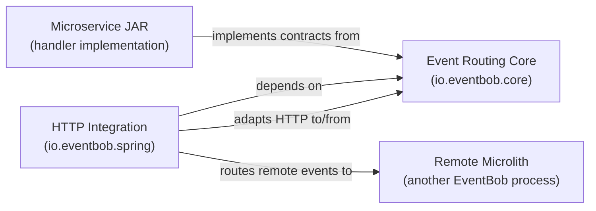
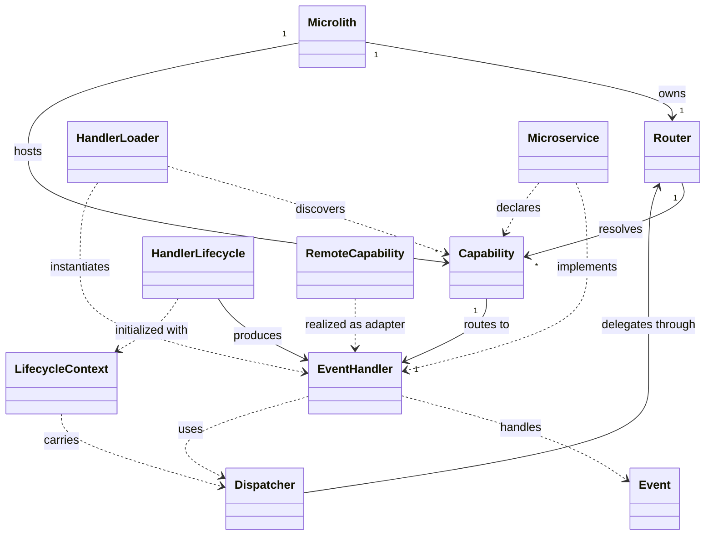

# EventBob Domain Specification

## 1. Domain Purpose and Scope

### Business problem being modeled

Many distributed systems over-decompose their services, resulting in chatty architectures where microservices make excessive network calls to each other. This saturates the network, degrades performance, and creates operational complexity that outweighs the benefits of decomposition.

EventBob models the concept of a **microlith**: a deployment unit that bundles multiple microservice capabilities into a single process, routing events between them in-process rather than over the network. The microlith remains architecturally a microservice to the outside world but eliminates inter-service network overhead for its bundled capabilities.

The core domain concern is **capability-based event routing**: discovering which capabilities exist, mapping events to the correct capability handler, and maintaining location transparency so that routing logic is independent of whether a capability is co-located or remote.

### Explicit non-goals

- Not a general-purpose messaging or event-streaming platform
- Not a solution for bidirectional deployment flexibility ("deploy together OR separately at will")
- Not a framework for domain event sourcing; the term "event" refers to a routing envelope, not a domain occurrence
- Not responsible for transport-level concerns such as HTTP, gRPC, or serialization format; those belong to infrastructure adapters
- Not a dependency injection container; handler wiring is the handler's own responsibility using whatever framework it chooses

---

## 2. Ubiquitous Language

### Core Terms

| Term (synonyms) | Definition | Context | Canonical Definition |
|---|---|---|---|
| Microlith | A deployment unit that bundles multiple microservice capabilities into a single process | Deployment, routing | A process hosting an EventBob router loaded with one or more capability handlers |
| Microservice | Code packaged in a JAR that integrates with EventBob by implementing one or more capability handlers | Integration | An independently developed and versioned unit of business capability, delivered as a JAR |
| Capability (capability identifier) | The named contract that a handler declares it can fulfill, identified by a string name and version | Routing, discovery | A unique, versioned identifier binding an event target to a handler within a microlith |
| EventHandler (handler) | The integration contract that a microservice implements to process events for a declared capability | Integration, routing | The single-method contract all handlers — local or remote — must satisfy |
| Event (routing envelope, message envelope) | An immutable transport envelope carrying routing information and a payload, passed between handlers | Routing | An immutable message with source, target, metadata, parameters, and an optional payload |
| Dispatcher | A facility provided to a handler at call time that allows it to send events to other capabilities | Handler execution | The outbound-event facility enabling a handler to delegate to other capabilities, locally or remotely |
| Router | The component that receives inbound events, resolves the target capability, and delivers the event to the registered handler | Routing | The single entry point for event processing within a microlith; owns the capability-to-handler registry |
| HandlerLoader (loader) | The mechanism for discovering and instantiating capability handlers from JARs or remote endpoints | Startup | The loading abstraction that returns a capability-to-handler map; hides all concrete loading strategies |
| HandlerLifecycle (lifecycle holder) | The container-side lifecycle contract for handlers that require initialization and cleanup | Lifecycle | The three-phase contract (initialize, retrieve, shutdown) between the EventBob container and a handler |
| LifecycleContext (lifecycle context) | The context carrier provided to a handler during initialization | Lifecycle | A value carrying configuration, an optional dispatcher, and an optional framework context |
| RemoteCapability | A mapping from capability name to a remote endpoint URI, representing a capability hosted in another process | Inter-microlith communication | A configuration record that declares a capability as remote and provides its network address |
| Location transparency | The property that routing logic treats local and remote handlers identically | Routing, architecture | The guarantee that remote handlers implement the same handler contract as local handlers; location is an infrastructure concern |
| EventDto | A data transfer object for serializing an event across an HTTP boundary | HTTP infrastructure | The anti-corruption layer at the HTTP boundary; translates between domain events and JSON representations |
| Metadata | Infrastructure-level routing and observability data carried in an event | Routing, observability | Key-value pairs in an event used for correlation, tracing, and reply routing; not business data |
| Parameters | Business data carried in an event | Domain | Key-value pairs in an event representing the business inputs to a capability |

### Commands

- RouteEvent: deliver an inbound event to the handler registered for the event's target capability within a microlith
- LoadHandlers: discover and instantiate all capability handlers from a set of JAR files or remote capability declarations, returning a capability-to-handler registry
- InitializeHandler: invoke the three-phase lifecycle on a handler that requires initialization, providing it with configuration, dispatcher, and optional framework context
- ShutdownMicrolith: close the router and all loaders, completing in-flight events and releasing handler resources in registration order
- DispatchEvent: send an outbound event from a running handler to another capability, either asynchronously or synchronously

### Domain Events

- CapabilityRegistered: a capability handler was discovered and added to the router's capability registry during microlith startup
- EventRouted: an inbound event was matched to a registered capability and delivered to its handler
- EventRoutingFailed: no handler was registered for the event's target capability; the error path was taken
- HandlerInitialized: a lifecycle handler completed its initialize phase and its handler instance was retrieved
- HandlerShutDown: a lifecycle handler completed its shutdown phase during microlith teardown
- CapabilityDuplicateDetected: two handlers declared the same capability identifier within a microlith; startup was aborted

### Queries

- ResolveCapability: look up the handler registered under a given capability name in the router's registry
- GetCapabilityMap: retrieve the full capability-to-handler map loaded by a HandlerLoader

---

## 3. Bounded Contexts

### Context: Event Routing Core

Description: The innermost domain layer. Defines the routing envelope, capability declaration, handler contract, loader abstraction, and lifecycle primitives. Carries no framework dependencies. All other modules depend on this context; it depends on none of them.

Business capability: capability-based in-process event routing and handler lifecycle management

### Context: HTTP Integration

Description: The Spring Boot infrastructure layer. Adapts inbound HTTP requests into domain events and routes them through the core router. Adapts remote capability endpoints into handler implementations via the adapter pattern, preserving location transparency. Owns all HTTP, JSON, and Spring concerns.

Business capability: exposing event routing over HTTP and bridging inter-microlith communication

---

## 4. Domain Model

---

## 5. AI Invariants: intention, purpose

- Capability identifiers are unique within a microlith: no two handlers may declare the same capability name and version; duplicate detection must cause a hard failure at load time, never at routing time
- Location transparency is unconditional: remote handlers must satisfy the same EventHandler contract as local handlers; routing logic must not contain any special cases for remote vs local execution
- Core has zero external dependencies: the event routing core depends only on the JDK; no framework, library, or infrastructure import is permitted in the core module
- Dependency direction is inward only: infrastructure and handler JARs depend on core; core never imports from infrastructure modules
- Events are immutable: an event instance is immutable after construction; the only mutation path is copy-on-write via a builder
- The container controls lifecycle: the EventBob container is the sole authority on when a handler is initialized and when it is shut down; handlers do not self-initialize
- Shutdown ordering is deterministic: the router must complete all in-flight handler executions before handler loaders are closed; lifecycle shutdown must complete before the handler's class loader is released
- Routing envelopes are not domain events: the term "event" in EventBob refers to a routing envelope (request/response wrapper), not to a domain occurrence in the event-sourcing sense; this distinction must be preserved in all documentation and code