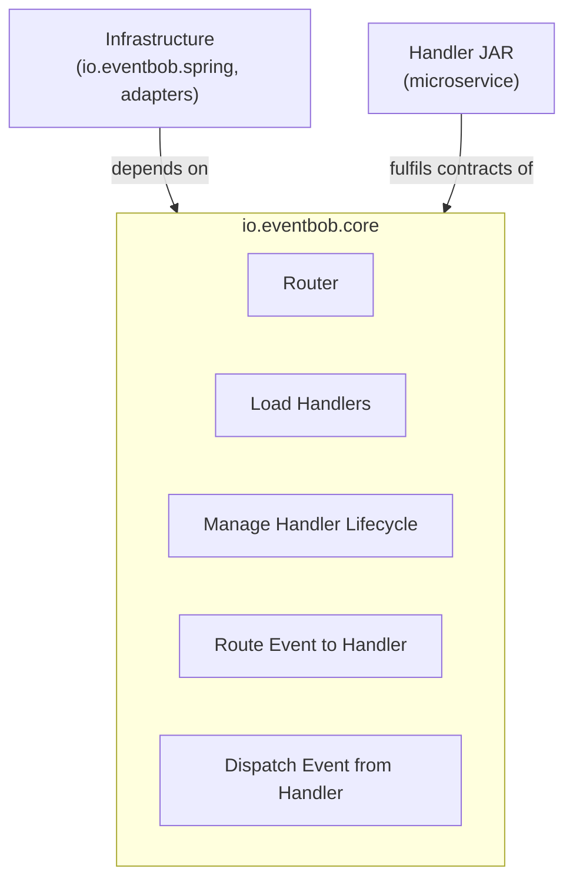
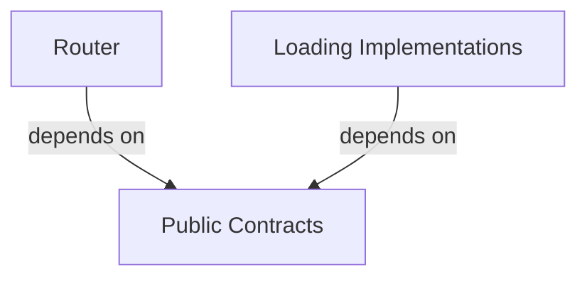
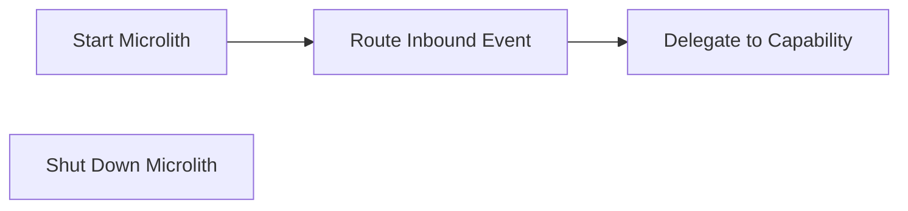

# io.eventbob.core Architecture

## 1. High Level Architectural Purpose

This module is the innermost domain layer of EventBob. It defines the event routing abstractions, handler loading contracts, and lifecycle primitives that every other module depends on. It carries no framework dependencies and establishes no outbound module references; all dependency arrows point inward toward this module.

---

## 2. Architectural Borders

### Border: Domain Kernel

The core module is isolated from all infrastructure. It exposes contracts — handler integration interfaces, lifecycle abstractions, and capability declaration markers — and hides all implementations behind factory methods. Infrastructure modules and handler JARs both depend on this boundary; the boundary never depends on them.

**Interactors:**

- Interactor: Load Handlers
  - Summary: Discovers and instantiates capability handlers from a set of JAR files, either as plain handlers or as lifecycle-managed handlers.
  - Flow: loader receives JAR paths at construction; for each JAR an isolated class loader is created and class files are scanned; capability-declaring handler implementations are identified; the loading strategy is resolved (plain or lifecycle); handlers are instantiated; duplicate capability names cause a hard failure; the resulting capability-to-handler map is returned; on close, class loaders are released and lifecycle shutdown is invoked in registration order.

- Interactor: Manage Handler Lifecycle
  - Summary: Coordinates the three-phase container lifecycle (initialise, retrieve, shutdown) for handlers that require dependency injection or resource management.
  - Flow: caller supplies a lifecycle context carrying a configuration map, an optional dispatcher, and an optional framework context; the lifecycle holder is initialised once with that context; the initialised handler instance is retrieved from the lifecycle holder; on container shutdown the lifecycle holder releases its resources before the associated class loader is closed.

- Interactor: Route Event to Handler
  - Summary: Matches an inbound event's target field against the registered capability map and delivers the event to the matching handler on a virtual thread.
  - Flow: an event is received; the router looks up the handler registered under the event's target capability name; if no registration exists an error path is taken and a fallback error event is produced; the matched handler is executed on a virtual thread pool; any handler failure is passed to the error callback; the result is returned as an asynchronous future.

- Interactor: Dispatch Event from Handler
  - Summary: Allows a running handler to send an outbound event to another capability, either asynchronously or synchronously.
  - Flow: the handler submits an outbound event through the dispatcher; the async path returns a future immediately; the sync path blocks until the future resolves or the timeout expires; interruption restores the interrupt flag and surfaces as a handling failure; execution failure unwraps the underlying cause; timeout surfaces as a handling failure.

---

## 3. Layers

### Layer: Public Contracts

**Description:** The stable surface exported to all dependents. Defines what the module provides without revealing how.

**Components:**
- Handler integration contract: the single-method contract that all capabilities — local or remote — must satisfy; receives a dispatcher for outbound delegation.
- Dispatcher: the outbound-event facility provided to handlers at call time; supports async and sync send semantics.
- Handler loader contract: the loading abstraction whose factory methods hide all concrete implementations; manages its own resources via a close contract.
- Lifecycle holder contract: the container-side lifecycle contract for handlers needing initialisation and cleanup; expressed as an abstract type to preserve binary compatibility across future lifecycle additions.
- Lifecycle context: a context carrier for handler initialisation supplying a configuration map, an optional dispatcher, and an optional framework context.
- Routing envelope: an immutable message carrying source, target, metadata, parameters, and payload.
- Capability marker: a repeatable declaration that binds a handler implementation to one or more capability identifiers.
- Standard metadata vocabulary: a vocabulary of well-known metadata key names for routing and observability.
- Failure types: a hierarchy of typed failures covering handler errors and routing misses.

**Inbound dependencies:** none — this is the innermost layer.
**Outbound dependencies:** JDK only.

### Layer: Loading Implementations

**Description:** Hidden implementations that fulfil the handler loader contract. Not reachable by external callers directly; accessed via factory methods on the public contracts.

**Components:**
- Plain handler loader: scans handler JARs using per-JAR isolated class loaders, discovers capability-declaring handlers, detects duplicates, and instantiates them.
- Lifecycle handler loader: reads a JAR's handler descriptor, instantiates the declared lifecycle holder, invokes initialisation, and tracks instances for ordered shutdown.

**Inbound dependencies:** Public Contracts layer.
**Outbound dependencies:** JDK only.

### Layer: Router

**Description:** The single public entry point for event processing. Holds the capability-to-handler map, owns the virtual thread executor, and exposes itself as a dispatcher.

**Components:**
- Event router: routes events by exact capability-name match; shuts down cleanly by awaiting in-flight handler completion before releasing resources.

**Inbound dependencies:** Public Contracts layer.
**Outbound dependencies:** JDK only.

---

## 4. Use Cases

### Use Case: Start Microlith

**Description:** Infrastructure creates a router instance, loads handlers from one or more sources, and registers them before accepting events.

**Scenarios:**
- Scenario: plain JAR loading → infrastructure uses the plain loader factory with JAR paths, obtains a capability map, registers each entry with the router builder, and completes startup.
- Scenario: lifecycle JAR loading → infrastructure uses the lifecycle loader factory with JAR paths and a dispatcher; the loader reads each JAR's handler descriptor, invokes initialisation, retrieves the handler instance, returns a capability map; infrastructure registers entries and completes startup.
- Alternate: inline lifecycle loading → infrastructure constructs a lifecycle context with an empty configuration and no framework context, invokes initialisation on each inline lifecycle holder, reads capability declarations from the resulting handler, registers entries, and completes startup.

### Use Case: Route Inbound Event

**Description:** The router receives an event, resolves the target capability, and delivers the event to the registered handler.

**Scenarios:**
- Scenario: known target → handler found by capability name; executed on a virtual thread; result event returned asynchronously.
- Alternate: unknown target → no registration for the target name; error callback invoked; if callback returns a non-null event that becomes the result; otherwise a fallback error event is produced and returned.
- Alternate: handler fails → failure propagates; error callback invoked; error event returned.

### Use Case: Delegate to Capability

**Description:** A running handler dispatches an outbound event to another capability within the same microlith.

**Scenarios:**
- Scenario: async dispatch → outbound event submitted to dispatcher; future returned immediately; caller controls timeout via the future.
- Alternate: sync dispatch → outbound event submitted; caller blocks until result or timeout; handling failure raised on timeout, interruption, or handler failure.

### Use Case: Shut Down Microlith

**Description:** Infrastructure closes the router and all handler loaders, completing in-flight events before releasing resources.

**Scenarios:**
- Scenario: ordered shutdown → router close is called; the virtual thread executor is shut down and the caller blocks until in-flight handlers complete; handler loaders are then closed; lifecycle-based loaders invoke each lifecycle holder's shutdown phase before releasing isolated class loaders.
- Alternate: interrupted shutdown → the await is interrupted; the interrupt flag is restored; the caller proceeds.

---

## 5. AI Invariants: structure, boundaries, dependency direction

- Zero external dependencies: this module depends only on the JDK. No framework, library, or infrastructure import is permitted.
- Inward dependency direction only: no type in this module may import from io.eventbob.spring or any other module. All dependency arrows point into this module.
- Public API minimal and stable: only handler contracts, lifecycle abstractions, capability markers, and value objects are public. All loader implementations are hidden and reachable only through factory methods.
- Immutable routing envelopes: event instances are immutable after construction. Copy-on-write via a builder is the only mutation path.
- Blocking close contract: the router's close operation must await completion of in-flight handlers before returning so callers can safely invoke lifecycle shutdown and release class loaders without use-after-free on handler classes.
- Capability uniqueness enforced at load time: duplicate capability names across JARs or inline registrations must cause a hard failure before the router is built.
- Lifecycle ordering: each lifecycle holder's shutdown phase must be invoked before the corresponding isolated class loader is closed so handlers can reference their own classes during cleanup.
