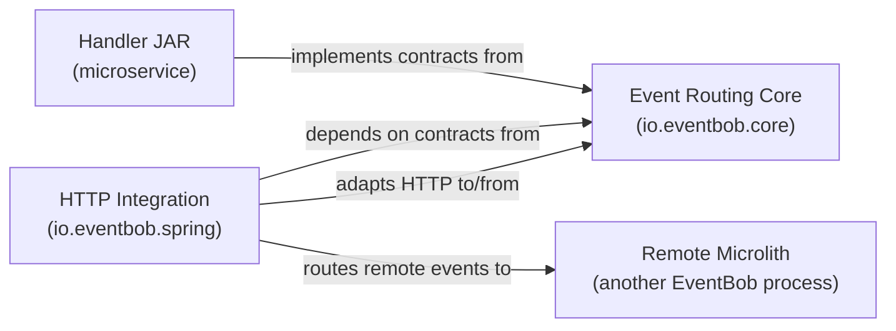
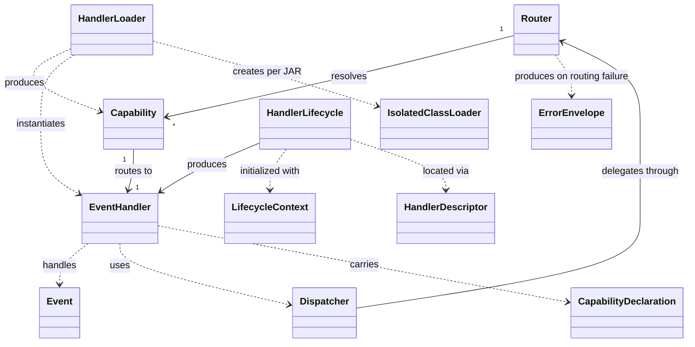

# io.eventbob.core Domain Specification

## 1. Domain Purpose and Scope

### Business problem being modeled

The `io.eventbob.core` module solves the problem of wiring multiple capability handlers into a single routing process without introducing framework dependencies or coupling loading strategies to routing logic. It provides the stable contracts that every handler, loader, and lifecycle implementation must satisfy, plus the concrete loading and routing machinery that implements those contracts using only the JDK.

Within the EventBob system, this module is the Event Routing Core bounded context: the innermost layer that owns the routing envelope, capability declaration mechanism, handler loading strategies, and handler lifecycle protocol. All other modules depend inward on these contracts; this module depends on nothing outside the JDK.

### Explicit non-goals

- Not responsible for HTTP, JSON serialization, or any transport-layer concern
- Not a dependency injection container; the lifecycle protocol delegates wiring responsibility entirely to the handler JAR
- Not a general-purpose class loader framework; the isolated class loader strategy is internal and not extensible from outside this module
- Not responsible for distributed tracing infrastructure; the standard metadata vocabulary defines key names only, not collection or propagation mechanics

---

## 2. Ubiquitous Language

### Core Terms

| Term (synonyms) | Definition | Context | Canonical Definition |
|---|---|---|---|
| Capability declaration (capability marker) | A repeatable annotation placed on a handler implementation class that binds that class to one or more capability names | Discovery, routing | The mechanism by which a handler class advertises the capability identifiers it can serve; a single class may carry multiple declarations, each naming a distinct capability |
| Handler descriptor (handler properties file) | The convention-based descriptor that a lifecycle-enabled handler JAR provides to identify the lifecycle implementation to instantiate | Lifecycle loading | The convention-based contract between a lifecycle-enabled handler JAR and the lifecycle loader; its presence signals that the JAR uses lifecycle-managed initialization |
| Isolated class loader (per-JAR class loader) | A dedicated class loader created for a single handler JAR, scoped to that JAR's classes while sharing core contracts | Class isolation, loading | The mechanism that keeps each handler JAR's classes separate from other JARs while sharing core contracts; one isolated class loader is created per JAR |
| Discovery phase | The first phase of plain handler loading, in which handler JARs are scanned and capability-annotated classes are identified without instantiation | Plain loading | The separation of class scanning from object creation inside the plain loader; produces a list of discovered handler records |
| Instantiation phase | The second phase of plain handler loading, in which discovered handler classes are instantiated exactly once and mapped to their declared capabilities | Plain loading | The object-creation step that follows the discovery phase; a handler class declaring multiple capabilities is instantiated once and shared across all its registrations |
| Error envelope (default error event) | A fallback routing envelope produced when no handler is registered for the target capability and the caller's error callback returns null or itself fails | Error handling | The guarantee that the router always returns a valid event; the error envelope carries the original event, the error message, and the error type in its payload |
| Standard metadata vocabulary | The set of well-known metadata key names defined by the core module for routing, correlation, and observability | Routing, observability | Canonical string keys carried in an event's Metadata map: `correlation-id`, `reply-to`, `method`, `path`, `trace-id`, `span-id` |

### Commands

- DeclareCapability: bind a handler class to one or more capability names by placing capability declarations on the class at compile time
- ScanJarForHandlers: traverse all class files in a handler JAR using an isolated class loader, identifying classes that carry capability declarations and implement the handler contract
- InstantiateHandler: construct a single handler instance from a discovered handler class; share the instance across all capability registrations for that class
- ReadHandlerDescriptor: read the handler descriptor from a lifecycle-enabled JAR to determine the lifecycle implementation to instantiate
- ProduceErrorEnvelope: construct a fallback routing envelope from the original event and the routing failure when the error callback returns null or fails

### Domain Events

- HandlerDiscovered: a class carrying at least one capability declaration and implementing the handler contract was found during JAR scanning
- CapabilityBound: a handler instance was successfully mapped to a capability name in the capability-to-handler registry
- HandlerDescriptorRead: a handler descriptor was found in a handler JAR and the lifecycle class name was extracted
- IsolatedClassLoaderCreated: an isolated class loader was created for a handler JAR during loading
- IsolatedClassLoaderReleased: a per-JAR isolated class loader was closed during microlith shutdown after all lifecycle shutdown phases completed
- ErrorEnvelopeProduced: a fallback routing envelope was constructed because the error callback returned null or itself threw

### Queries

- InspectCapabilityDeclarations: read all capability declarations from a handler class to determine its declared capability names
- LookupHandlerDescriptor: check whether a handler JAR's class loader exposes a handler descriptor resource and return its contents

---

## 3. Bounded Contexts

### Context: Event Routing Core

Description: The innermost domain layer. Defines the routing envelope, capability declaration mechanism, handler integration contract, loader abstraction, and lifecycle protocol. Carries no framework dependencies. Provides concrete loading machinery (plain JAR loading and lifecycle JAR loading) hidden behind factory methods. All other modules depend on this context; it depends on none of them.

Business capability: capability-based in-process event routing, handler discovery from JARs, and handler lifecycle coordination

---

## 4. Domain Model

---

## 5. AI Invariants: intention, purpose

- Capability declarations are the sole discovery mechanism: the loader must not register any handler that does not carry at least one capability declaration on its class; annotation absence must cause the class to be silently skipped, not a hard failure
- One isolated class loader per JAR: the plain and lifecycle loaders must create exactly one isolated class loader per JAR file; sharing class loaders across JARs is forbidden
- Discovery precedes instantiation in plain loading: the discovery phase must complete across all JARs before any handler is instantiated; duplicate capability names must be detected and cause a hard failure before instantiation begins
- Handler descriptor is optional for plain loading, required for lifecycle loading: the plain loader must skip any class that lacks capability declarations; the lifecycle loader must skip any JAR that lacks a handler descriptor
- Error envelope is unconditional: the router must never propagate an unhandled exception to the caller; if the error callback returns null or itself throws, an error envelope must be produced from the original event
- Standard metadata vocabulary is additive and non-prescriptive: the core module defines key names as a shared vocabulary; handlers and infrastructure may add further metadata keys without violating any invariant; the core module must not validate metadata key presence
- Lifecycle shutdown precedes class loader release: for every lifecycle loader, all lifecycle shutdown phases must complete before any isolated class loader is closed; releasing a class loader before its lifecycle shuts down places handler classes in an undefined state
- Inline lifecycle loading shares the same lifecycle contract: handlers initialized inline (without a JAR) must satisfy the same three-phase lifecycle contract as JAR-loaded handlers; the container must not distinguish inline from JAR-loaded when invoking initialize, getHandler, or shutdown
