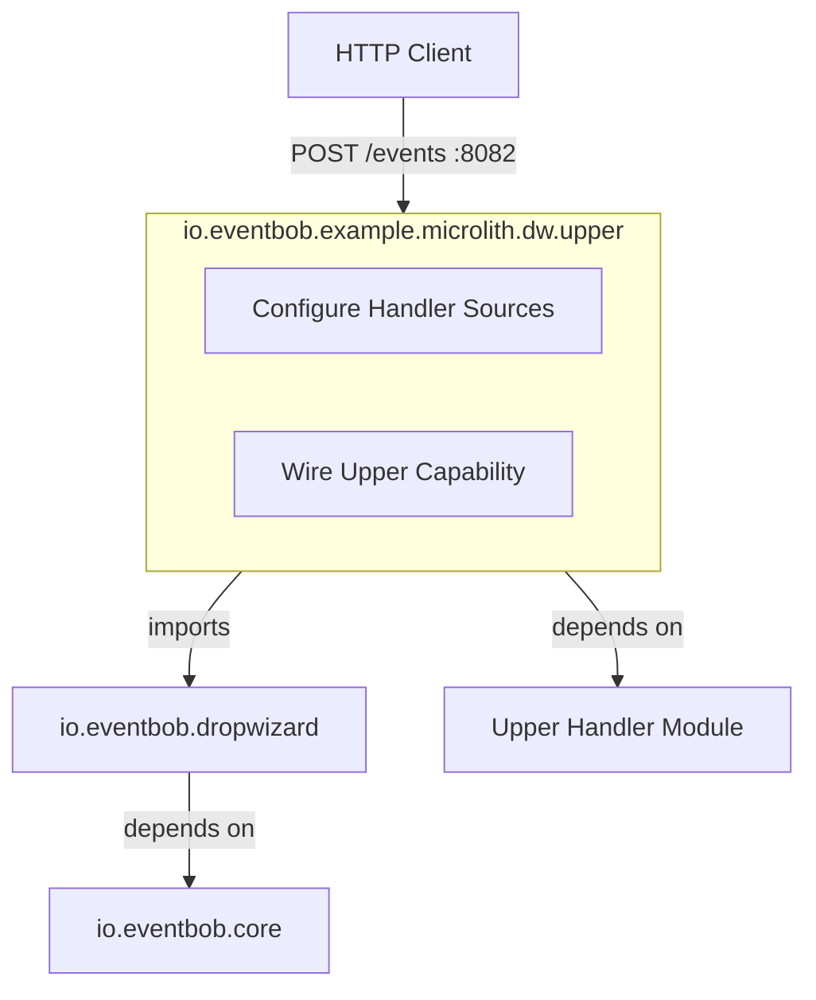
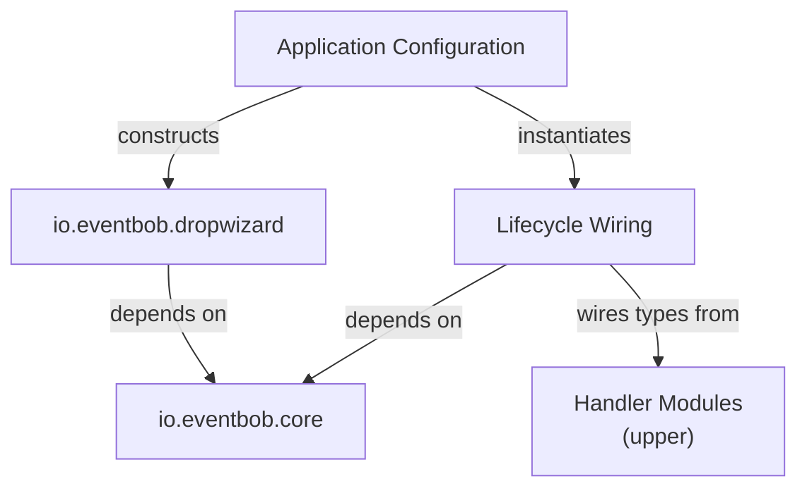
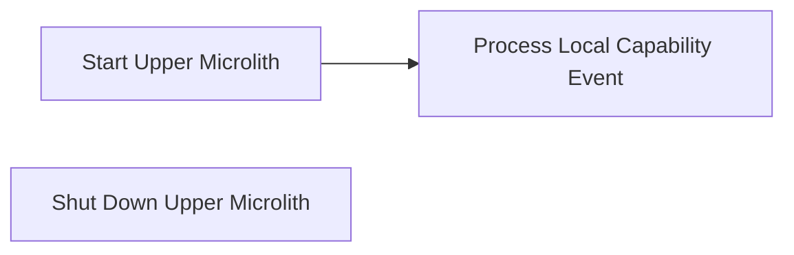

# io.eventbob.example.microlith.dw.upper Architecture

## 1. High Level Architectural Purpose

This module is the outermost application layer: a concrete, deployable microlith. It composes the io.eventbob.dropwizard library with a single locally-wired capability (upper), producing a single runnable process. Its sole architectural role is configuration and wiring — it contains no domain logic and no infrastructure code of its own.

---

## 2. Architectural Borders

### Border: Microlith Application

The module owns the boundary where abstract library configuration becomes concrete deployment decisions: which capability is served locally, and on which port the service listens. Unlike the echo microlith, this module declares no remote capability — `remoteCapabilities` is passed as `null` to EventBobBundle.

**Interactors:**

- Interactor: Configure Handler Sources
  - Summary: Declares the upper handler source as a constructor argument so EventBobBundle can assemble the router instance.
  - Flow: UpperApplication's `initialize(Bootstrap<Configuration>)` registers an EventBobBundle constructed with `handlerJarPaths=null`, `inlineLifecycles=List.of(new UpperHandlerLifecycle())`, and `remoteCapabilities=null`; Dropwizard's run phase invokes `EventBobBundle.run(configuration, environment)`, which initialises the inline lifecycle, builds the router, and registers EventResource with Jersey; the embedded server starts on the configured port.

- Interactor: Wire Upper Capability
  - Summary: Initialises the upper capability via plain `new` construction and registers the resulting handler.
  - Flow: EventBobBundle invokes `initialize(LifecycleContext)` on UpperHandlerLifecycle; UpperHandlerLifecycle constructs `new UpperHandler(new UpperService())` directly, with no framework context or container involved — the lifecycle holds only a private field for the handler instance; EventBobBundle reads the capability declaration from the handler and registers it under the "upper" name; on teardown, EventBobBundle's `Managed.stop()` invokes `shutdown()` on UpperHandlerLifecycle, which sets the field to null.

---

## 3. Layers

### Layer: Application Configuration

**Description:** The single entry point of the process. Declares the upper handler source as a constructor argument; delegates all wiring to the library.

**Components:**
- UpperApplication: an `Application<Configuration>` subclass; constructs EventBobBundle with the upper inline lifecycle and no remote capabilities; registers the bundle in `initialize(Bootstrap<Configuration>)`; its `run(Configuration, Environment)` override is empty, since EventBobBundle performs all wiring.

**Inbound dependencies:** Dropwizard application runtime (startup).
**Outbound dependencies:** io.eventbob.dropwizard (EventBobBundle); Lifecycle Wiring layer.

### Layer: Lifecycle Wiring

**Description:** Connects the upper handler implementation to EventBobBundle via the lifecycle holder contract. The lifecycle holder wires its handler using plain `new` construction — no framework context, container, or bean mechanism is involved.

**Components:**
- UpperHandlerLifecycle: fulfils the lifecycle holder contract; constructs the upper handler and its dependencies via direct `new` calls; holds the handler in a plain private field; clears the field on shutdown.

**Inbound dependencies:** io.eventbob.core (lifecycle holder contract, lifecycle context, handler integration contract).
**Outbound dependencies:** io.eventbob.example.upper (upper handler and supporting services).

---

## 4. Use Cases

### Use Case: Start Upper Microlith

**Description:** The process boots, wires the upper capability, and begins accepting HTTP events.

**Scenarios:**
- Scenario: successful startup → the Dropwizard runtime initialises; EventBobBundle initialises UpperHandlerLifecycle, registers "upper" locally; the healthcheck is registered; the router is built; EventResource is registered with Jersey; the embedded server starts on app port 8082 (admin port 8083).
- Alternate: lifecycle initialisation failure → UpperHandlerLifecycle's initialisation raises an error; EventBobBundle propagates the failure; Dropwizard startup fails; the process exits.

### Use Case: Process Local Capability Event

**Description:** An inbound HTTP event targets "upper"; the event is handled in-process by the wired handler.

**Scenarios:**
- Scenario: upper event → `POST http://localhost:8082/events` with `{"source": "client", "target": "upper", "payload": "hello"}`; EventResource routes to the router; router dispatches to the upper handler; response returned as `{"source": "upper", "target": "client", "parameters": {}, "metadata": {}, "payload": "HELLO"}` (verified directly against this port).
- Scenario: healthcheck event → POST to the events endpoint with target "healthcheck"; built-in HealthcheckHandler (from the library) responds with health status.

### Use Case: Shut Down Upper Microlith

**Description:** Dropwizard stops the managed lifecycle; the inline lifecycle holder is shut down cleanly.

**Scenarios:**
- Scenario: clean shutdown → `Managed.stop()` invokes shutdown on UpperHandlerLifecycle; the private handler field is cleared; resources released.
- Alternate: shutdown failure → UpperHandlerLifecycle's shutdown raises an error; the error is logged.

---

## 5. AI Invariants: structure, boundaries, dependency direction

- Configuration only: this module must contain no domain logic and no infrastructure code. Only Application/Bootstrap wiring and lifecycle holder construction belong here.
- No direct core dependency for routing: this module does not interact with the router directly; all routing is managed by the imported io.eventbob.dropwizard library.
- No framework context per lifecycle holder: UpperHandlerLifecycle holds only a plain private field for its handler instance; it wires dependencies via direct `new` construction with no framework container involved.
- Handler module remains framework-agnostic: io.eventbob.example.upper must not gain framework dependencies as a result of this module. Framework-facing wiring lives exclusively in UpperHandlerLifecycle.
- No remote delegation: this module hosts a single local capability; `remoteCapabilities` is passed as `null` to EventBobBundle.
- Dependency direction: this module depends on io.eventbob.dropwizard; io.eventbob.dropwizard must not depend on this module.
