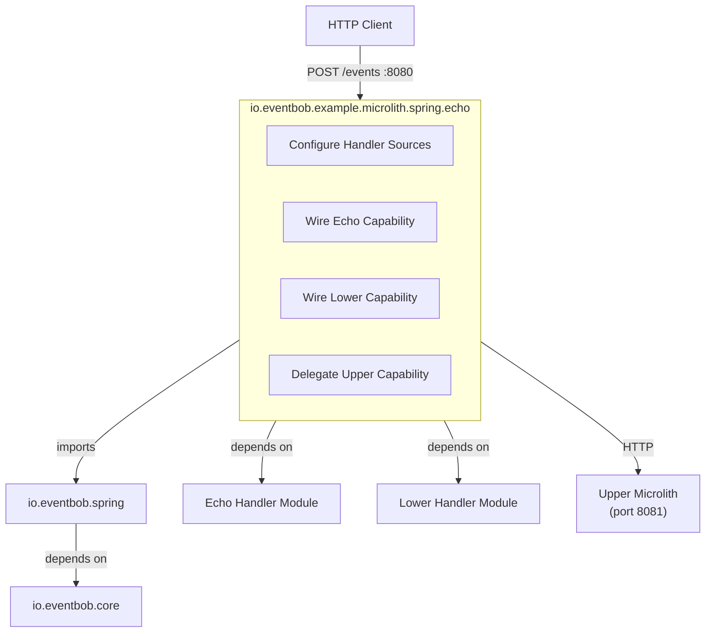
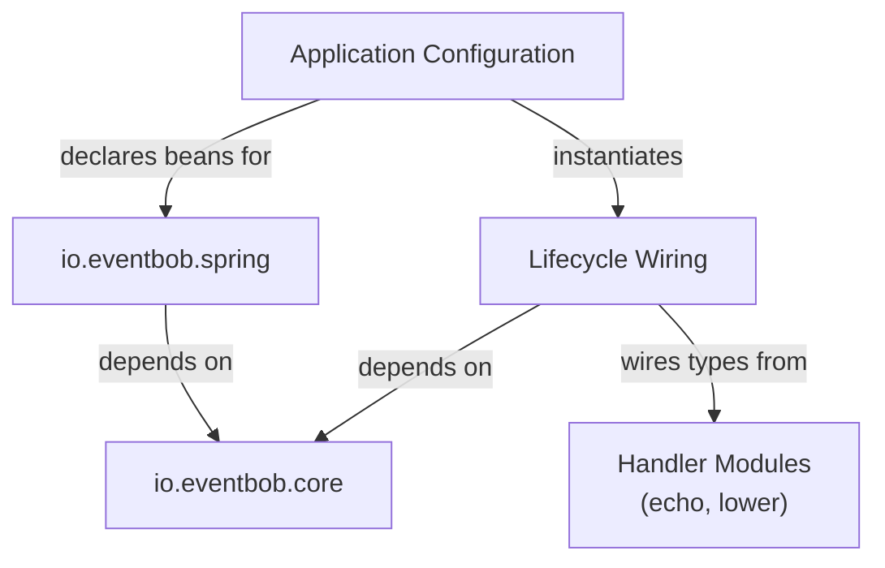
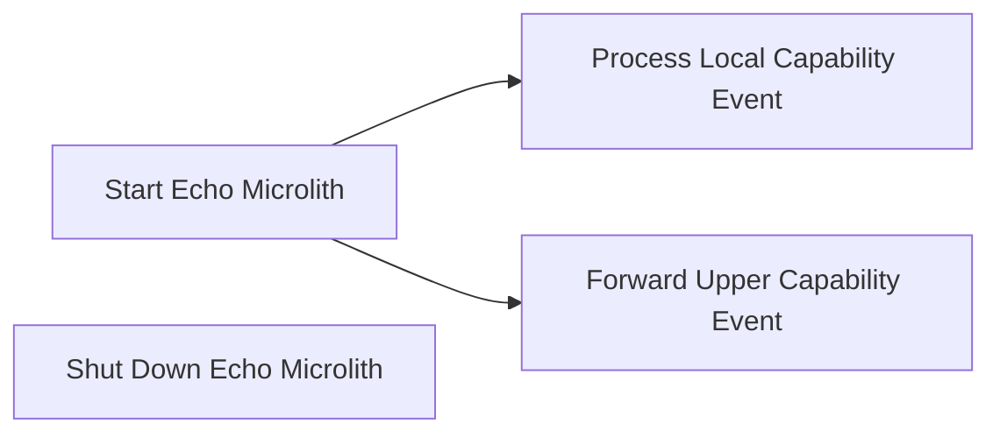

# io.eventbob.example.microlith.spring.echo Architecture

## 1. High Level Architectural Purpose

This module is the outermost application layer: a concrete, deployable microlith. It composes the io.eventbob.spring library with two locally-wired capabilities (echo and lower) and one remote capability delegation (upper), producing a single runnable process. Its sole architectural role is configuration and wiring — it contains no domain logic and no infrastructure code of its own.

---

## 2. Architectural Borders

### Border: Microlith Application

The module owns the boundary where abstract library configuration becomes concrete deployment decisions: which capabilities are served locally, which are delegated remotely, and on which port the service listens.

**Interactors:**

- Interactor: Configure Handler Sources
  - Summary: Declares all handler source beans so the library's wiring configuration can assemble the router instance.
  - Flow: the framework runtime starts; the application entry point's bean declarations produce the echo lifecycle holder, the lower lifecycle holder, and the remote capability declaration list; the library's wiring configuration collects them via injection; it initialises the inline lifecycle holders, creates HTTP adapters for remote capabilities, builds the router; the embedded server starts on the configured port.

- Interactor: Wire Echo Capability
  - Summary: Initialises the echo capability using an isolated framework context and registers the resulting handler.
  - Flow: the wiring configuration invokes initialisation on the echo lifecycle holder with a context; the lifecycle holder creates an isolated framework context, loads the echo handler's configuration, refreshes the context, and retrieves the handler instance; the wiring configuration reads the capability declaration from the handler and registers it under the "echo" name; on teardown the wiring configuration invokes shutdown on the lifecycle holder, which closes the isolated context.

- Interactor: Wire Lower Capability
  - Summary: Initialises the lower capability using an isolated framework context and registers the resulting handler.
  - Flow: identical pattern to Wire Echo Capability; the lower lifecycle holder creates an isolated context for the lower handler; the handler is registered under the "lower" name.

- Interactor: Delegate Upper Capability
  - Summary: Declares "upper" as a remote capability pointing to the upper microlith so the router forwards "upper" events via HTTP.
  - Flow: the remote capability declaration list bean contains a declaration mapping "upper" to the upper microlith's endpoint; the wiring configuration's remote loader creates an HTTP adapter for this entry; the adapter is registered under "upper"; inbound events targeting "upper" are forwarded via HTTP to the upper microlith's events endpoint.

---

## 3. Layers

### Layer: Application Configuration

**Description:** The single entry point of the process. Declares all handler source beans; delegates all wiring to the library.

**Components:**
- Application entry point: declares the echo lifecycle holder bean, the lower lifecycle holder bean, and the remote capability declaration list bean; imports the library wiring configuration; provides the component scan scope that picks up the inbound endpoint.

**Inbound dependencies:** Spring Boot runtime (application startup).
**Outbound dependencies:** io.eventbob.spring (wiring configuration, remote capability declaration); Lifecycle Wiring layer.

### Layer: Lifecycle Wiring

**Description:** Connects handler implementations from the handler modules to the container via the lifecycle holder contract. Each lifecycle holder creates an isolated framework context so handlers share no beans and have no inter-handler coupling.

**Components:**
- Echo lifecycle holder: fulfils the lifecycle holder contract; creates an isolated framework context for the echo handler and its dependencies; closes the context on shutdown.
- Lower lifecycle holder: fulfils the lifecycle holder contract; creates an isolated framework context for the lower handler and its dependencies; closes the context on shutdown.

**Inbound dependencies:** io.eventbob.core (lifecycle holder contract, lifecycle context, handler integration contract); Spring (isolated annotation-driven application context).
**Outbound dependencies:** io.eventbob.example.echo (echo handler and supporting services); io.eventbob.example.lower (lower handler and supporting services).

---

## 4. Use Cases

### Use Case: Start Echo Microlith

**Description:** The process boots, wires all capabilities, and begins accepting HTTP events.

**Scenarios:**
- Scenario: successful startup → the framework initialises; the echo and lower lifecycle holder beans are created; the wiring configuration initialises both, registers "echo" and "lower" locally; the remote capability declaration for "upper" is registered as an HTTP adapter; the healthcheck is registered; the router is built; the inbound endpoint is bound to the events path; the embedded server starts on port 8080.
- Alternate: lifecycle initialisation failure → a lifecycle holder's initialisation raises an error; the wiring configuration propagates the failure; the framework startup fails; the process exits.

### Use Case: Process Local Capability Event

**Description:** An inbound HTTP event targets either "echo" or "lower"; the event is handled in-process by the wired handler.

**Scenarios:**
- Scenario: echo event → POST to the events endpoint with target "echo"; inbound endpoint routes to router; router dispatches to echo handler; handler returns the event unchanged; wire-format response sent to caller.
- Scenario: lower event → POST to the events endpoint with target "lower"; inbound endpoint routes to router; router dispatches to lower handler; handler transforms the payload to lowercase; response returned.
- Scenario: healthcheck event → POST to the events endpoint with target "healthcheck"; built-in healthcheck handler (from library) responds with health status.

### Use Case: Forward Upper Capability Event

**Description:** An inbound HTTP event targets "upper"; the router delegates it to the upper microlith via the remote handler adapter.

**Scenarios:**
- Scenario: remote available → POST to the events endpoint with target "upper"; router delivers to remote handler adapter; adapter posts to the upper microlith's events endpoint; upper microlith processes and responds; adapter translates response to domain event; wire-format response returned to original caller.
- Alternate: remote unavailable → transport exception raised; handling failure propagates; router applies error callback; error event returned to caller.

### Use Case: Shut Down Echo Microlith

**Description:** The framework context closes; inline lifecycle holders are shut down cleanly.

**Scenarios:**
- Scenario: clean shutdown → teardown invoked on the echo and lower lifecycle holders; each closes its isolated framework context; resources released.
- Alternate: partial failure → one lifecycle holder's shutdown raises an error; error logged; remaining lifecycle holders continue shutting down.

---

## 5. AI Invariants: structure, boundaries, dependency direction

- Configuration only: this module must contain no domain logic and no infrastructure code. Only framework bean declarations and lifecycle holder wiring belong here.
- No direct core dependency for routing: this module does not interact with the router directly; all routing is managed by the imported io.eventbob.spring library.
- Isolated lifecycle contexts: each lifecycle holder creates its own isolated framework context. No beans are shared between the echo lifecycle holder and the lower lifecycle holder.
- Handler modules remain framework-agnostic: io.eventbob.example.echo and io.eventbob.example.lower must not gain framework dependencies as a result of this module. Framework wiring lives exclusively in the lifecycle holder classes within this module.
- Remote delegation is configuration, not code: the "upper" delegation is expressed as a remote capability declaration bean. No custom adapter code lives in this module.
- Dependency direction: this module depends on io.eventbob.spring; io.eventbob.spring must not depend on this module.
