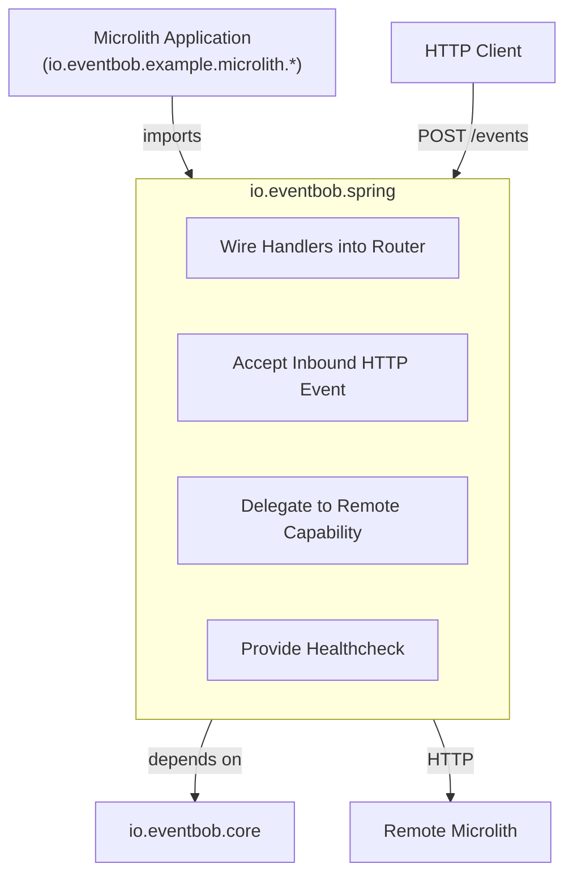
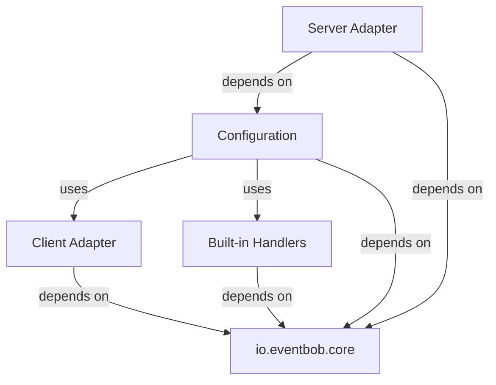
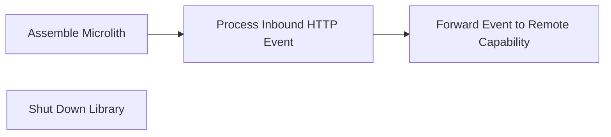

# io.eventbob.spring Architecture

## 1. High Level Architectural Purpose

This module is the infrastructure library layer of EventBob. It bridges the framework-agnostic core domain to the Spring Boot runtime by providing an HTTP server adapter for inbound event processing, an HTTP client adapter for outbound remote-capability delegation, a Spring-aware wiring configuration that aggregates multiple handler sources, and a built-in healthcheck capability. It is a reusable library — it ships no entry point and hard-codes no configuration. Concrete microlith applications import it and supply handler sources as injectable beans.

---

## 2. Architectural Borders

### Border: Spring Infrastructure Library

The module sits between microlith applications — which configure it — and the core domain — which it adapts. It never lets framework types, serialisation annotations, or HTTP client primitives cross into the core. Translation always occurs at this layer's boundary via a dedicated transfer object.

**Interactors:**

- Interactor: Wire Handlers into Router
  - Summary: Collects all handler sources — inline lifecycle holders, JAR-based lifecycle holders, and remote capability declarations — initialises them, detects duplicates, and produces a fully configured router instance.
  - Flow: the wiring configuration receives optional inline lifecycle holders, optional JAR paths, and optional remote capability declarations via constructor injection; for each inline lifecycle holder a context is created with an empty configuration and no framework context, initialisation is invoked, capability declarations are read from the resulting handler, and the handler is registered; for JAR paths the lifecycle loader is used to obtain a capability map which is merged into the registration; for remote capability declarations the remote loader creates an HTTP adapter per entry and merges those into the registration; duplicate capability names across all three sources cause a hard failure before the router is built; the built-in healthcheck is registered unconditionally; the router is built and exposed; on teardown each inline lifecycle holder's shutdown phase is invoked in registration order.

- Interactor: Accept Inbound HTTP Event
  - Summary: Translates an HTTP POST carrying a wire-format event into a domain event, routes it through the router, and maps the response back to wire format for the HTTP reply.
  - Flow: an HTTP POST arrives at the events endpoint; the wire-format body is deserialised; the wire representation is converted to a domain event; the router processes the event asynchronously; the framework suspends the response; when the future completes the domain event is converted back to wire format; the wire-format body is sent to the caller.

- Interactor: Delegate to Remote Capability
  - Summary: Wraps a remote microlith's events endpoint as a handler so the router treats it identically to a local handler.
  - Flow: the remote loader creates one HTTP adapter per remote capability declaration; each adapter is registered under the declared capability name; when the router delivers an event to that capability the adapter converts the domain event to wire format, posts it to the remote endpoint, deserialises the response from wire format back to a domain event, and returns the result; HTTP error status codes and network failures are surfaced as handling failures.

- Interactor: Provide Healthcheck
  - Summary: Built-in handler registered under the "healthcheck" capability, returning system health status.
  - Flow: an event targeting the healthcheck capability arrives; the built-in handler produces a health status response event; the result is returned to the caller.

---

## 3. Layers

### Layer: Configuration

**Description:** Aggregates all handler sources and produces the router bean. The single integration point that microlith applications interact with through the framework's dependency injection mechanism.

**Components:**
- Wiring configuration: accepts handler sources via optional constructor injection, loads and de-duplicates them, wires the router, and manages inline lifecycle teardown on context close.

**Inbound dependencies:** Spring Boot dependency injection; beans from the importing microlith application.
**Outbound dependencies:** io.eventbob.core (router, handler loader, lifecycle contracts), Client Adapter layer, Built-in Handlers layer.

### Layer: Server Adapter

**Description:** Accepts inbound HTTP events and translates between the HTTP wire representation and the domain model.

**Components:**
- Inbound endpoint: exposes the HTTP events endpoint; delegates to the router and returns the result asynchronously; contains no business logic.
- Wire transfer object: the anti-corruption DTO for the HTTP boundary; carries serialisation metadata; translates to and from the domain routing envelope; never crosses into the core.

**Inbound dependencies:** Spring Web (HTTP request handling); JSON deserialisation.
**Outbound dependencies:** io.eventbob.core (routing envelope, router).

### Layer: Client Adapter

**Description:** Enables outbound inter-microlith communication by representing remote capabilities as local handler instances.

**Components:**
- Remote handler adapter: implements the handler integration contract; converts the domain routing envelope to wire format, posts to the remote endpoint, converts the wire-format response back to a domain routing envelope; surfaces all transport and protocol failures as handling failures.
- Remote loader: implements the handler loader contract; creates one remote handler adapter per remote capability declaration and returns the capability-to-adapter map.
- Remote capability declaration: a configuration value object mapping a capability name to a remote endpoint URI.
- Wire transfer object: shared with the Server Adapter layer for JSON translation; the same DTO is used for both inbound and outbound wire format.

**Inbound dependencies:** JDK HTTP client; JSON serialisation.
**Outbound dependencies:** io.eventbob.core (handler integration contract, handler loader contract, routing envelope, handling failure type).

### Layer: Built-in Handlers

**Description:** Infrastructure-owned capabilities that ship with the library.

**Components:**
- Healthcheck handler: implements the handler integration contract under the "healthcheck" capability; returns health status; registered unconditionally by the wiring configuration.

**Inbound dependencies:** none beyond core contracts.
**Outbound dependencies:** io.eventbob.core (handler integration contract, routing envelope).

---

## 4. Use Cases

### Use Case: Assemble Microlith

**Description:** A microlith application starts; the wiring configuration collects all handler sources, initialises them, and produces a ready router instance.

**Scenarios:**
- Scenario: inline lifecycle holders only → application declares lifecycle holder beans; wiring configuration invokes initialisation on each, reads capability declarations, registers handlers with the router.
- Scenario: JAR-based lifecycle holders only → application declares a JAR path list bean; wiring configuration invokes the lifecycle loader, receives a capability map, registers all entries.
- Scenario: remote capabilities only → application declares a remote capability declaration list bean; wiring configuration creates the remote loader, receives an adapter map, registers all entries.
- Alternate: hybrid sources → any combination of the three sources; wiring configuration merges all maps and causes a hard failure on any duplicate capability name across sources.

### Use Case: Process Inbound HTTP Event

**Description:** An HTTP client sends a POST to the events endpoint; the inbound endpoint routes it through the router and returns the response.

**Scenarios:**
- Scenario: handler found → wire-format body received; converted to domain event; router processes event and returns a future; framework suspends; handler completes; result converted to wire format; HTTP 200 response sent.
- Alternate: handler not found → router returns an error event; error wrapped in wire format; HTTP 200 with error payload returned to caller.

### Use Case: Forward Event to Remote Capability

**Description:** The router delivers an event to a capability backed by the remote handler adapter, which transparently delegates to a remote microlith.

**Scenarios:**
- Scenario: remote available → domain event converted to wire format; HTTP POST sent to remote endpoint; 2xx response body parsed as wire format; domain event returned to router.
- Alternate: remote HTTP error → 4xx or 5xx status received; handling failure raised; router applies the error callback.
- Alternate: network failure → transport exception raised; wrapped in a handling failure; interrupt flag restored on interruption.

### Use Case: Shut Down Library

**Description:** The framework context closes; the wiring configuration tears down inline lifecycle holders in registration order.

**Scenarios:**
- Scenario: clean shutdown → shutdown invoked on each inline lifecycle holder; each releases its resources.
- Alternate: partial failure → one lifecycle holder's shutdown raises an error; error is logged; shutdown continues for remaining holders.

---

## 5. AI Invariants: structure, boundaries, dependency direction

- Dependency direction: this module depends on io.eventbob.core; io.eventbob.core must never depend on this module.
- No framework leakage: framework types, serialisation annotations, and HTTP client types must never cross into io.eventbob.core. All translation occurs in the wire transfer object and adapters within this module.
- Thin adapters: the inbound endpoint and remote handler adapter perform protocol translation only. Business logic belongs in the core or in handler JARs.
- Library contract: this module ships no entry point and no hard-coded handler configuration. All handler sources are provided by the importing application via constructor injection.
- Wire transfer object boundary discipline: the wire transfer object is the anti-corruption layer for the HTTP wire format. It must not be used as a domain object or passed through to core routing logic.
- Location transparency preserved: the remote loader registers remote handler adapters under capability names indistinguishable from local handler registrations. The core router must not and cannot observe the difference.
- Duplicate capability detection: the wiring configuration must detect and reject duplicate capability names across all three handler sources before building the router.
