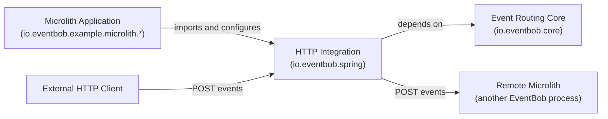

# HTTP Integration — Domain Specification

## 1. Domain Purpose and Scope

### Business problem being modeled

Microliths must accept events submitted over HTTP from external clients and from other microliths, and must be able to delegate events to capabilities hosted in remote microliths. Neither of these concerns can be allowed to pollute the framework-agnostic event routing core. This module models the translation work that occurs at the HTTP boundary: receiving inbound requests and turning them into domain routing envelopes, and wrapping remote capability endpoints so that they satisfy the same handler contract as locally loaded handlers.

The module also models the assembly of a microlith from heterogeneous handler sources — inline lifecycle holders, JAR-based lifecycle holders, and remote capability declarations — producing a single, fully configured router that serves as the microlith's internal routing hub.

### Explicit non-goals

- Not responsible for event routing logic; that belongs to the Event Routing Core context
- Not a handler implementation; handler business logic ships in separate microservice JARs
- Not a general HTTP proxy or API gateway; it exposes exactly one routing endpoint
- Not responsible for authentication, authorisation, or rate-limiting at the HTTP boundary
- Not a configuration system; all handler sources are provided by the importing microlith application

---

## 2. Ubiquitous Language

### Core Terms

| Term (synonyms) | Definition | Context | Canonical Definition |
|---|---|---|---|
| Wire Transfer Object (wire-format DTO) | The anti-corruption translation object that carries an event's fields across the HTTP boundary in serialisable form | HTTP boundary | A value object that converts bidirectionally between the domain routing envelope and JSON wire format; it never crosses into the core and is never used as a domain object |
| Inbound Endpoint (events endpoint) | The single HTTP entry point that receives routing envelopes submitted by external callers and routes them through the local router | Server adapter | The HTTP surface of a microlith; it deserialises the wire format, invokes the router, and serialises the result back to wire format |
| Remote Handler Adapter (HTTP adapter) | An implementation of the handler contract that wraps a remote microlith's inbound endpoint and makes it indistinguishable from a local handler at the routing level | Client adapter | The adapter that converts domain routing envelopes to wire format, posts them to a remote inbound endpoint, and converts the response back to a domain routing envelope |
| Remote Loader | The handler loader implementation that creates one remote handler adapter per remote capability declaration and returns the resulting capability-to-adapter map | Startup, client adapter | The loading strategy for remote capabilities; it satisfies the HandlerLoader contract using RemoteCapability configuration records |
| Wiring Configuration (microlith assembler) | The single integration point that collects all handler sources, initialises them, detects duplicate capability names, and produces a ready router bean | Startup, configuration | The component that merges inline, JAR-based, and remote handler sources into a single capability registry and builds the router |
| Healthcheck Capability | A built-in handler shipped with this library and registered unconditionally under the "healthcheck" capability name | Built-in handlers | The infrastructure-owned capability that returns system health status; it requires no configuration and cannot be overridden by a handler source |
| Inline Lifecycle Holder | A handler lifecycle holder provided directly by the importing microlith application as a framework-injectable bean, bypassing JAR loading | Startup | A HandlerLifecycle instance declared as a bean and injected into the wiring configuration; its initialisation and shutdown are managed by the wiring configuration |
| Handling Failure | The domain-level error that surfaces transport problems, HTTP error responses, and wire-format parse errors back into the routing core as a uniform failure type | Client adapter, error handling | The core's error type used to communicate handler-level failures; remote adapter failures are always reported through this type |

### Commands

- AssembleMicrolith: collect all handler sources, initialise inline lifecycle holders, load JAR-based and remote capability maps, detect duplicates, register the built-in healthcheck, and build the router
- AcceptInboundEvent: receive an HTTP POST carrying a wire-format routing envelope, translate it to a domain routing envelope, route it through the local router, and return the result as wire format
- ForwardToRemoteCapability: translate a domain routing envelope to wire format, POST it to a remote inbound endpoint, parse the response, and return the resulting domain routing envelope
- ShutdownLibrary: invoke the shutdown phase on all inline lifecycle holders in registration order, releasing their resources

### Domain Events

- MicrolithAssembled: the wiring configuration successfully merged all handler sources, registered the built-in healthcheck, and produced a ready router
- DuplicateCapabilityRejected: two handler sources declared the same capability name; assembly was aborted before the router was built
- InboundEventAccepted: an HTTP POST arrived at the inbound endpoint and was successfully translated into a domain routing envelope for routing
- RemoteDelegationSucceeded: the remote handler adapter received a 2xx response and returned a domain routing envelope to the router
- RemoteDelegationFailed: the remote handler adapter encountered an HTTP error or network failure and surfaced a handling failure to the router
- LifecycleHolderShutDown: an inline lifecycle holder completed its shutdown phase during library teardown

### Queries

- ResolveHandlerSources: retrieve all inline lifecycle holders, JAR paths, and remote capability declarations available in the importing application's context
- GetRemoteAdapterMap: retrieve the capability-to-remote-handler-adapter map produced by the remote loader for a given set of remote capability declarations

---

## 3. Bounded Contexts



### Context: HTTP Integration

Description: The bounded context responsible for the HTTP surface of a microlith. It owns the translation between the HTTP wire format and domain routing envelopes in both directions, the assembly of a router from heterogeneous handler sources, and the structural guarantee that remote capabilities satisfy the same handler contract as local ones. It carries no business logic and hard-codes no handler configuration; all domain knowledge lives in the core or in handler JARs.

Business capability: exposing event routing over HTTP and making inter-microlith remote delegation transparent to the routing core

### Context: Event Routing Core

Description: Defines the routing envelope, handler contract, loader abstraction, lifecycle primitives, and the router. This context is upstream of HTTP Integration; HTTP Integration depends on it. Referenced here as the upstream context whose contracts this module adapts to and from the HTTP wire format.

Business capability: capability-based in-process event routing and handler lifecycle management

---

## 4. Domain Model

```mermaid
classDiagram
  WiringConfiguration "1" --> "1" Router : produces
  WiringConfiguration "1" --> "*" InlineLifecycleHolder : initialises and shuts down
  WiringConfiguration "1" --> "1" RemoteLoader : delegates to
  WiringConfiguration "1" --> "1" HealthcheckCapability : registers unconditionally
  RemoteLoader "1" --> "*" RemoteCapability : reads
  RemoteLoader "1" --> "*" RemoteHandlerAdapter : creates
  RemoteHandlerAdapter ..> WireTransferObject : translates through
  InboundEndpoint ..> WireTransferObject : translates through
  InboundEndpoint ..> Router : routes through
  RemoteHandlerAdapter ..> HandlingFailure["Handling Failure"] : surfaces on error
```

---

## 5. AI Invariants: intention, purpose

- The wire transfer object is the sole crossing point between the HTTP wire format and the domain model; it must never be used as a domain object or passed through core routing logic
- The remote handler adapter must implement the handler contract without modification; the core router must not and cannot distinguish a remote adapter from a local handler
- Duplicate capability names across all handler sources must cause a hard failure before the router is built; the wiring configuration is the single enforcement point for this rule
- The healthcheck capability is unconditional; no handler source may suppress or override it, and its registration must always precede router construction
- All transport failures, HTTP error responses, and wire-format parse errors that occur in a remote handler adapter must be surfaced exclusively as handling failures; no HTTP or transport type may cross into the core
- Inline lifecycle holders are owned by the wiring configuration for the duration of the library's lifetime; their shutdown must occur in registration order on library teardown
- This module ships no entry point and no hard-coded handler configuration; all handler sources are provided by the importing microlith application through the framework's dependency injection mechanism
