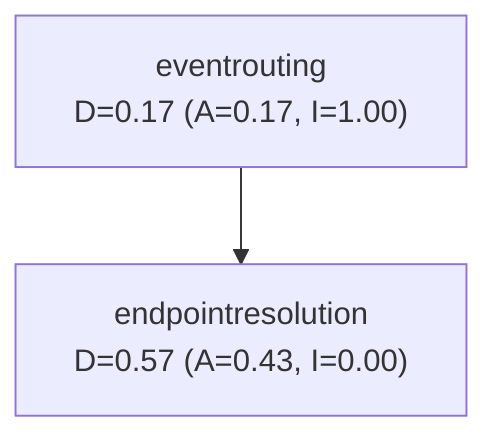

# Core Module Architecture

## Module: io.eventbob.core

**Purpose:** Define the event routing domain model with two cohesive subdomains: event routing and endpoint resolution.

**Version:** 1.0.0-SNAPSHOT

**Last Updated:** 2026-02-12

---

## Package Structure

```
io.eventbob.core
├── eventrouting/                      # Event Routing Subdomain
│   ├── Event.java
│   ├── EventHandler.java
│   ├── EventHandlingRouter.java
│   ├── DecoratedEventHandler.java
│   ├── EventHandlerCapability.java
│   ├── MetadataKeys.java
│   ├── EventHandlingException.java
│   ├── HandlerNotFoundException.java
│   └── UnexpectedEventHandlingException.java
└── endpointresolution/                # Endpoint Resolution Subdomain
    ├── Capability.java
    ├── CapabilityResolver.java
    ├── RoutingKey.java
    ├── Endpoint.java
    └── EndpointState.java
```

---

## Subdomains

### Event Routing (`eventrouting`)

**Responsibility:** Route events by target to handlers. Manage event lifecycle, decoration, and exception handling.

**Key Types:**
- **Event** — Immutable event data structure (source, target, metadata, parameters, payload)
- **EventHandler** — Universal interface for event processing
- **EventHandlingRouter** — Routes events by target string to specific handlers
- **DecoratedEventHandler** — Wraps handlers with cross-cutting concerns (logging, metrics, error handling)
- **MetadataKeys** — Standard metadata vocabulary (correlation-id, method, path, trace-id, etc.)
- **Exception hierarchy** — EventHandlingException, HandlerNotFoundException, UnexpectedEventHandlingException

**Dependencies:**
- → `endpointresolution.Capability` (EventHandlerCapability annotation references Capability enum)
- No other internal dependencies

**Stability:** Instability = 1.00 (maximally unstable, depends on stable abstractions)

---

### Endpoint Resolution (`endpointresolution`)

**Responsibility:** Define the port/abstraction for resolving service capabilities to physical endpoints. Support progressive deployment states.

**Key Types:**
- **Capability** — Enum of operation types (READ, WRITE, ADMIN)
- **CapabilityResolver** — Interface (port) for resolving routing keys to endpoints
- **RoutingKey** — Immutable identifier for a service operation (service + capability + method + path)
- **Endpoint** — Physical endpoint address with deployment version and state
- **EndpointState** — Deployment state enum (GREEN, BLUE)

**Dependencies:**
- None (zero outgoing dependencies within core)

**Stability:** Instability = 0.00 (maximally stable, pure abstraction/port layer)

---

## Dependency Rules

**Enforced by:** `CoreArchitectureTest` (ArchUnit)

### Rule 1: Event Routing → Endpoint Resolution (ONE-WAY)

✅ **Allowed:** `eventrouting` can depend on `endpointresolution`
- EventHandlerCapability annotation references Capability enum

❌ **Blocked:** `endpointresolution` cannot depend on `eventrouting`
- Endpoint resolution is a stable port, routing is an unstable implementation

### Rule 2: No Cyclic Dependencies

✅ **Enforced:** All packages within core must be acyclic
- Prevents hidden coupling and ensures clean boundaries

### Rule 3: Zero External Dependencies

✅ **Enforced:** Core can only depend on:
- JDK (`java.**`)
- SLF4J (`org.slf4j.**`) — logging abstraction only

❌ **Blocked:** No frameworks, no HTTP libraries, no external dependencies

### Rule 4: Package Naming Convention

✅ **Enforced:** All classes must reside in recognized packages:
- `io.eventbob.core.eventrouting.**`
- `io.eventbob.core.endpointresolution.**`

---

## Martin Metrics

**Generated by:** `CoreArchitectureTest.generateMermaidDependencyGraph()`

**Metrics:**
- **A** (Abstractedness) = abstract classes / total classes
- **I** (Instability) = outgoing deps / total deps
- **D** (Distance from Main Sequence) = |A + I - 1|

**Current Values:**
```
eventrouting:
  D = 0.17 (A = 0.17, I = 1.00)
  → 17% abstract, 100% unstable (concrete implementations)

endpointresolution:
  D = 0.57 (A = 0.43, I = 0.00)
  → 43% abstract, 0% unstable (stable port with value types)
```

**Ideal:**
- Abstract and stable: A=1, I=0 (pure abstractions)
- Concrete and unstable: A=0, I=1 (pure implementations)

**Interpretation:**
- `endpointresolution` is close to ideal stable port (I=0.00)
- `eventrouting` is close to ideal concrete implementation (I=1.00)
- Both are within acceptable distance from main sequence

**Dependency Graph:**


---

## Design Rationale

### Why Two Subdomains?

**Event Routing** and **Endpoint Resolution** serve different purposes:

1. **Event Routing** is about dispatching events to handlers
   - In-process concern: which handler receives this event?
   - Uses target string for simple lookup
   - Manages exception handling and decoration

2. **Endpoint Resolution** is about finding physical locations
   - Cross-process concern: where is this capability hosted?
   - Uses capability metadata (READ/WRITE/ADMIN) + operation signature
   - Supports progressive deployment (GREEN/BLUE endpoints)

**Are they separate bounded contexts?**
No. They share ubiquitous language (no terms change meaning across boundary). They are **subdomains within ONE bounded context** (Event Routing), separated for dependency management and architectural clarity.

### Why Flatten Exceptions?

Previously exceptions were in `eventrouting/exceptions/` subpackage. They were moved into `eventrouting/` directly because:

1. **Domain language:** Exceptions describe routing failures (HandlerNotFoundException), not general resolution failures. They are part of routing vocabulary.
2. **Eliminate cycles:** Separate exceptions package created bidirectional dependency (routing → exceptions → routing for Event reference).
3. **Simplicity:** Fewer layers, cohesive domain concepts in one package.

### Why Allow eventrouting → endpointresolution?

The `EventHandlerCapability` annotation (in eventrouting) references `Capability` enum (in endpointresolution). This dependency exists because:

1. **Purpose:** The annotation declares what capabilities a handler provides (metadata for registration)
2. **Stable dependency:** eventrouting (unstable, I=1.00) depends on endpointresolution (stable, I=0.00) — correct direction
3. **Acceptable coupling:** The annotation is about registration metadata, not core routing logic

**Alternative considered:** Move EventHandlerCapability to endpointresolution. Rejected because the annotation marks EventHandlers (routing concept), not endpoints (resolution concept).

---

## Ports & Adapters

### Ports Defined by Core

**CapabilityResolver** (`endpointresolution.CapabilityResolver`)
- Resolves service capabilities to physical endpoints
- Implementation will be provided by registry module (infrastructure layer)
- Supports both single endpoint and multi-endpoint resolution (for load balancing)

**EventHandler** (`eventrouting.EventHandler`)
- Universal interface for event processing
- Implemented by:
  - Services (business logic)
  - Routers (delegation)
  - Decorators (cross-cutting concerns)
  - Adapters (transport translation)

### Adapters Implement Core Ports

**Future:** When registry module is implemented, it will provide `CapabilityResolver` implementation backed by PostgreSQL.

---

## Evolution History

### 2026-02-12: Bounded Context Reorganization

**Change:** Restructured from flat package to subdomain packages

**Before:**
```
io.eventbob.core/
  Event.java
  EventHandler.java
  EventHandlingRouter.java
  ...
  exceptions/
    EventHandlingException.java
    HandlerNotFoundException.java
```

**After:**
```
io.eventbob.core/
  eventrouting/
    Event.java
    EventHandler.java
    EventHandlingRouter.java
    EventHandlingException.java     # Flattened
    HandlerNotFoundException.java   # Flattened
  endpointresolution/
    Capability.java
    CapabilityResolver.java
    RoutingKey.java
    Endpoint.java
    EndpointState.java
```

**Rationale:**
1. Explicit bounded context structure for architectural clarity
2. Enforce dependency direction via ArchUnit tests
3. Prevent cyclic dependencies
4. Prepare for registry module implementation (will depend on endpointresolution port)

**Impact:**
- All imports updated from `io.eventbob.core.*` to `io.eventbob.core.{subdomain}.*`
- ArchUnit tests enforce new boundaries
- Martin metrics improve (clean dependency direction)

---

## Testing Strategy

### ArchUnit Tests

**File:** `CoreArchitectureTest.java`

**Enforces:**
1. Dependency direction (eventrouting → endpointresolution, not reverse)
2. No cyclic dependencies
3. Zero external dependencies (except JDK, SLF4J)
4. Package naming convention

**Generates:**
- Dependency graph with Martin metrics (`docs/core_dependency_graph.md`)

### Unit Tests

**Coverage:**
- Event creation, validation, immutability
- EventHandlingRouter dispatching and error handling
- DecoratedEventHandler hook execution
- MetadataKeys usage patterns

**Pattern:** Simple stubs over mocks, infrastructure-free tests

---

## Future Extensions

### When Registry Module is Implemented

**New module:** `io.eventbob.registry`

**Dependencies:**
- io.eventbob.registry → io.eventbob.core.endpointresolution (implements CapabilityResolver port)
- Registry will provide PostgreSQL-backed capability resolution
- Registry will scan JARs for @EventHandlerCapability annotations and persist to database

### When Adapters are Implemented

**New modules:** `io.eventbob.adapter.http`, `io.eventbob.adapter.grpc`, etc.

**Dependencies:**
- Adapters → io.eventbob.core.eventrouting (implement EventHandler)
- Adapters will translate transport protocols to Event domain model
- Adapters will define transport-specific metadata namespaces

---

## Non-Goals

**This module does NOT:**
- Provide persistence (registry module concern)
- Provide transport adapters (adapter module concern)
- Define business domain models (service concern)
- Manage deployment lifecycle (infrastructure concern)

**This module IS:**
- Pure domain model for event routing
- Stable contract for implementation modules
- Zero-dependency, framework-agnostic foundation
