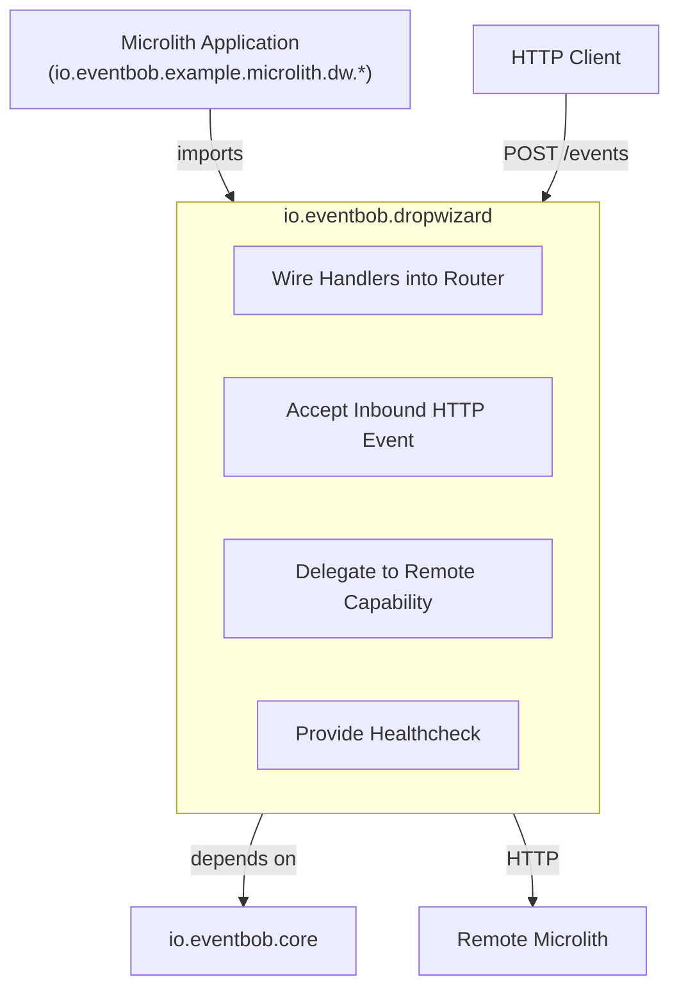
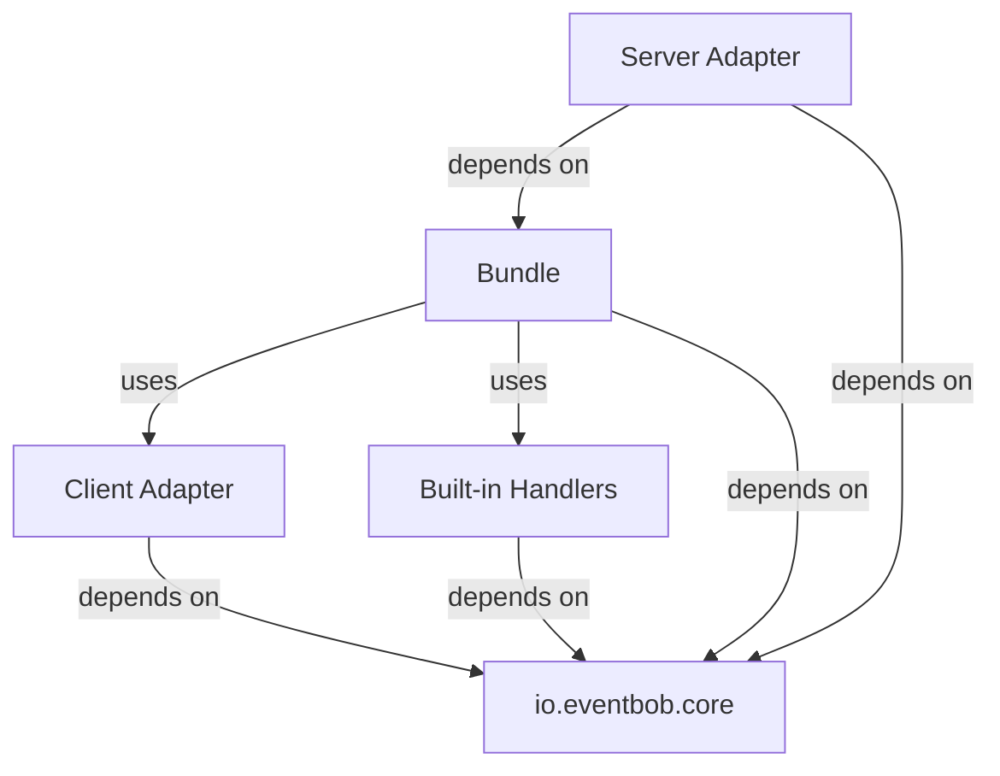
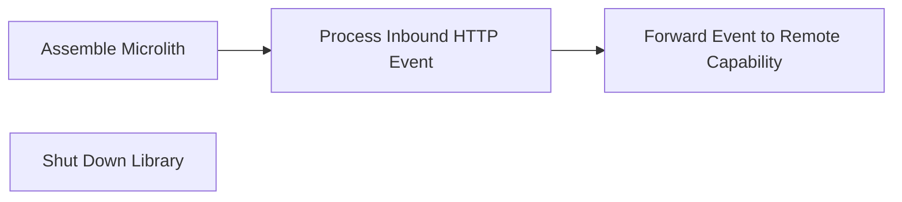

# io.eventbob.dropwizard Architecture

## 1. High Level Architectural Purpose

This module is the infrastructure library layer of EventBob. It bridges the framework-agnostic core domain to the Dropwizard runtime by providing EventResource, a JAX-RS `POST /events` endpoint for inbound event processing, HttpEventHandlerAdapter and RemoteHandlerLoader for outbound remote-capability delegation, EventBobBundle — a `ConfiguredBundle<Configuration>` and `Managed` implementation — that aggregates multiple handler sources, and a built-in healthcheck capability via HealthcheckHandler. It is a reusable library — it ships no entry point and hard-codes no configuration. All three of EventBobBundle's constructor arguments (`handlerJarPaths`, `inlineLifecycles`, `remoteCapabilities`) are nullable; concrete microlith applications import the library and supply whichever handler sources apply.

---

## 2. Architectural Borders

### Border: Dropwizard Infrastructure Library

The module sits between microlith applications — which configure it — and the core domain — which it adapts. It never lets framework types, serialisation annotations, or HTTP client primitives cross into the core. Translation always occurs at this layer's boundary via a dedicated transfer object.

**Interactors:**

- Interactor: Wire Handlers into Router
  - Summary: Collects all handler sources — inline lifecycle holders, JAR-based lifecycle holders, and remote capability declarations — initialises them, detects duplicates, and produces a fully configured router instance.
  - Flow: EventBobBundle receives optional handler JAR paths, optional inline lifecycles, and optional remote capability declarations via constructor arguments (all three nullable, defaulted to empty lists); at Dropwizard's `run(Configuration, Environment)` phase, `EventBobBundle.eventBob(...)` registers the built-in healthcheck handler unconditionally first, then calls `loadAllHandlers(httpClient)`, which registers handler sources strictly in sequence: inline lifecycles are initialised first — each lifecycle's `initialize(LifecycleContext)` is invoked with an empty configuration and no dispatcher, its handler's `@Capability` declarations are read and registered, and each new inline capability is cross-checked against the inline capabilities already registered in this pass; next, JAR-based lifecycle handlers are loaded via `HandlerLoader.lifecycleLoader` and checked against everything registered so far (the inline lifecycles); finally, remote capability declarations are loaded via RemoteHandlerLoader, creating one HttpEventHandlerAdapter per entry, and checked against everything registered so far (inline plus JAR); each of these three stages throws `IllegalStateException` immediately on a name collision with what has already been registered, before `EventBob.Builder.build()` constructs the router; on teardown (`Managed.stop()`), each inline lifecycle's `shutdown()` is invoked in registration order, followed by `EventBob.close()`.

- Interactor: Accept Inbound HTTP Event
  - Summary: Translates an HTTP POST carrying a wire-format event into a domain event, routes it through the router, and maps the response back to wire format for the HTTP reply.
  - Flow: an HTTP POST arrives at EventResource's `/events` endpoint; Jersey deserialises the body into an EventDto; `EventDto.toEvent()` converts it to a domain event; `EventBob.processEvent(event, errorCallback)` routes it through the router and returns a `CompletableFuture<Event>`; Jersey suspends the response pending the future; when the future completes, `EventDto.fromEvent(...)` converts the result back to wire format; the wire-format body is returned to the caller.

- Interactor: Delegate to Remote Capability
  - Summary: Wraps a remote microlith's events endpoint as a handler so the router treats it identically to a local handler.
  - Flow: RemoteHandlerLoader creates one HttpEventHandlerAdapter per RemoteCapability declaration; each adapter is registered under the declared capability name; when the router delivers an event to that capability, the adapter converts the domain event to wire format via `EventDto.fromEvent`, POSTs it to `remoteEndpoint.resolve("/events")` using the JDK `HttpClient`, and on a 2xx response parses the body back into an EventDto and returns the resulting domain event; HTTP 4xx/5xx responses and network failures are wrapped as `EventHandlingException` and surfaced as handling failures.

- Interactor: Provide Healthcheck
  - Summary: Built-in handler registered unconditionally under the "healthcheck" capability, returning system health status.
  - Flow: an event targeting the healthcheck capability arrives; HealthcheckHandler returns the same event with payload set to `true`; the result is returned to the caller.

---

## 3. Layers

### Layer: Bundle

**Description:** Aggregates all handler sources and produces the router. The single integration point that microlith applications interact with by passing constructor arguments and registering the bundle with Dropwizard's `Bootstrap`.

**Components:**
- EventBobBundle: accepts handler sources via nullable constructor arguments, loads and de-duplicates them, wires the router, and manages inline lifecycle teardown via a registered `Managed` instance.

**Inbound dependencies:** Dropwizard bootstrap/run lifecycle; constructor arguments from the importing microlith application.
**Outbound dependencies:** io.eventbob.core (router, handler loader, lifecycle contracts), Client Adapter layer, Built-in Handlers layer.

### Layer: Server Adapter

**Description:** Accepts inbound HTTP events and translates between the HTTP wire representation and the domain model.

**Components:**
- EventResource: exposes the JAX-RS `/events` endpoint; delegates to the router and returns the result asynchronously via `CompletableFuture`; contains no business logic.
- EventDto: the anti-corruption DTO for the HTTP boundary; carries serialisation metadata; translates to and from the domain routing envelope; never crosses into the core.

**Inbound dependencies:** Jersey/JAX-RS (HTTP request handling); Jackson JSON deserialisation.
**Outbound dependencies:** io.eventbob.core (routing envelope, router).

### Layer: Client Adapter

**Description:** Enables outbound inter-microlith communication by representing remote capabilities as local handler instances.

**Components:**
- HttpEventHandlerAdapter: extends core's synchronous forwarding template (`SyncForwardingEventHandler`) to implement the handler integration contract; converts the domain routing envelope to wire format, posts to the remote endpoint, converts the wire-format response back to a domain routing envelope; surfaces all transport and protocol failures as handling failures.
- RemoteHandlerLoader: implements the handler loader contract; creates one HttpEventHandlerAdapter per remote capability declaration and returns the capability-to-adapter map.
- RemoteCapability: a configuration value object mapping a capability name to a remote endpoint URI.
- EventDto: shared with the Server Adapter layer for JSON translation; the same DTO is used for both inbound and outbound wire format.

**Inbound dependencies:** JDK HTTP client; Jackson JSON serialisation.
**Outbound dependencies:** io.eventbob.core (handler integration contract, handler loader contract, routing envelope, handling failure type).

### Layer: Built-in Handlers

**Description:** Infrastructure-owned capabilities that ship with the library.

**Components:**
- HealthcheckHandler: implements the handler integration contract under the "healthcheck" capability; returns health status; registered unconditionally by EventBobBundle.

**Inbound dependencies:** none beyond core contracts.
**Outbound dependencies:** io.eventbob.core (handler integration contract, routing envelope).

---

## 4. Use Cases

### Use Case: Assemble Microlith

**Description:** A microlith application starts; `EventBobBundle.run(Configuration, Environment)` collects all handler sources, initialises them, and registers a ready EventBob router with Jersey.

**Scenarios:**
- Scenario: inline lifecycles only → application constructs EventBobBundle with a non-null `inlineLifecycles` list; EventBobBundle invokes `initialize` on each, reads capability declarations, registers handlers with the router.
- Scenario: JAR-based lifecycles only → application constructs EventBobBundle with a non-null `handlerJarPaths` list; EventBobBundle invokes `HandlerLoader.lifecycleLoader`, receives a capability map, registers all entries.
- Scenario: remote capabilities only → application constructs EventBobBundle with a non-null `remoteCapabilities` list; EventBobBundle creates RemoteHandlerLoader, receives an adapter map, registers all entries.
- Alternate: hybrid sources → any combination of the three sources; EventBobBundle merges all maps and throws `IllegalStateException` on any duplicate capability name across sources, in the inline → JAR → remote registration order.

### Use Case: Process Inbound HTTP Event

**Description:** An HTTP client sends a POST to `/events` with a request body that must include a non-blank `"source"` field; EventResource routes it through the router and returns the response.

**Scenarios:**
- Scenario: handler found → wire-format body received as EventDto; converted to a domain Event; `EventBob.processEvent` returns a `CompletableFuture`; Jersey suspends; handler completes; result converted back to EventDto; HTTP 200 response sent. For example, `{"source":"client","target":"echo","payload":"hello world"}` is routed to the echo capability.
- Alternate: handler not found → router applies the error callback and returns an error event; error wrapped in EventDto; HTTP 200 with error payload returned to caller.

### Use Case: Forward Event to Remote Capability

**Description:** The router delivers an event to a capability backed by HttpEventHandlerAdapter, which transparently delegates to a remote microlith.

**Scenarios:**
- Scenario: remote available → domain event converted to EventDto; HTTP POST sent to `remoteEndpoint.resolve("/events")`; 2xx response body parsed as EventDto; domain event returned to router.
- Alternate: remote HTTP error → 4xx or 5xx status received; `EventHandlingException` raised; router applies the error callback.
- Alternate: network failure → `IOException` wrapped in `EventHandlingException`; interrupt flag restored on `InterruptedException`.

### Use Case: Shut Down Library

**Description:** Dropwizard stops the managed lifecycle; the `Managed` instance registered by `EventBobBundle.run` tears down inline lifecycle holders in registration order, then closes the router.

**Scenarios:**
- Scenario: clean shutdown → `Managed.stop()` invokes `shutdownInlineLifecycles()`, calling `shutdown()` on each inline lifecycle holder in registration order; then `eb.close()` completes in-flight handler executions and releases resources.
- Alternate: partial failure → one lifecycle holder's shutdown raises an exception; the exception is caught and logged as a warning; shutdown continues for remaining holders.

---

## 5. AI Invariants: structure, boundaries, dependency direction

- Dependency direction: this module depends on io.eventbob.core; io.eventbob.core must never depend on this module.
- No framework leakage: framework types, serialisation annotations, and HTTP client types must never cross into io.eventbob.core. All translation occurs in EventDto and the adapters within this module.
- Thin adapters: EventResource and HttpEventHandlerAdapter perform protocol translation only. Business logic belongs in the core or in handler JARs.
- Library contract: this module ships no entry point and no hard-coded handler configuration. All handler sources are provided by the importing application via EventBobBundle's constructor arguments.
- Wire transfer object boundary discipline: EventDto is the anti-corruption layer for the HTTP wire format. It must not be used as a domain object or passed through to core routing logic.
- Location transparency preserved: RemoteHandlerLoader registers HttpEventHandlerAdapter instances under capability names indistinguishable from local handler registrations. The core router must not and cannot observe the difference.
- Duplicate capability detection: EventBobBundle must detect and reject duplicate capability names across all three handler sources before building the router.
