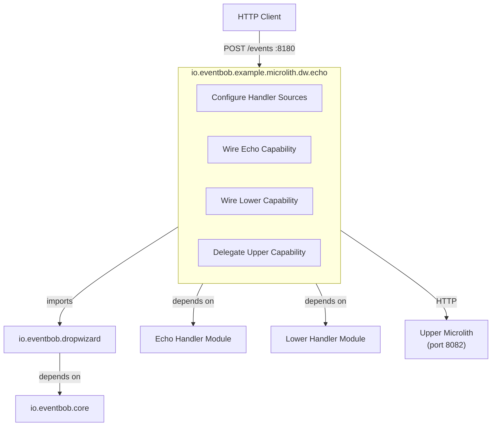
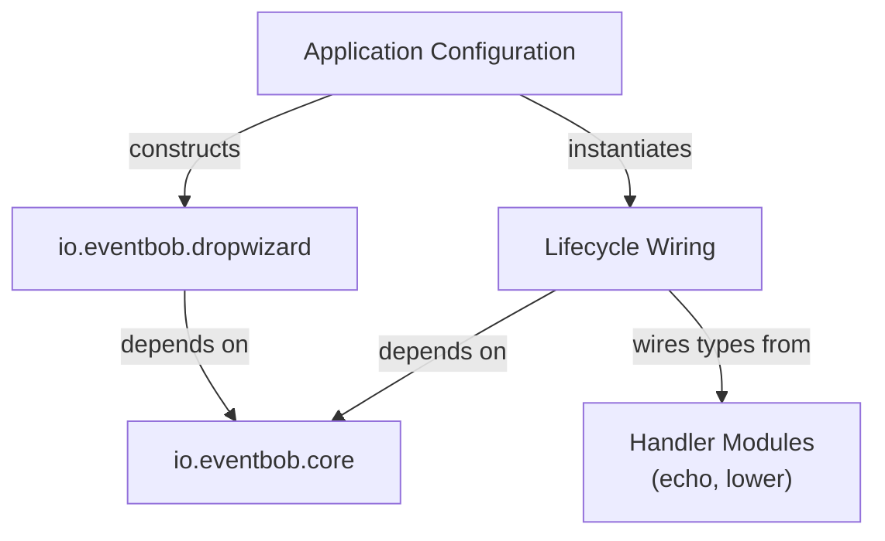
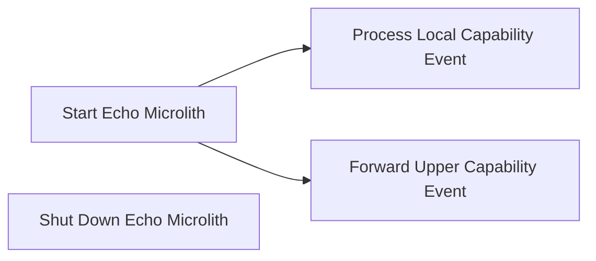

# io.eventbob.example.microlith.dw.echo Architecture

## 1. High Level Architectural Purpose

This module is the outermost application layer: a concrete, deployable microlith. It composes the io.eventbob.dropwizard
library with two locally-wired capabilities (echo and lower) and one remote capability delegation (upper), producing a
single runnable process. Its sole architectural role is configuration and wiring — it contains no domain logic and no
infrastructure code of its own.

---

## 2. Architectural Borders

### Border: Microlith Application

The module owns the boundary where abstract library configuration becomes concrete deployment decisions: which
capabilities are served locally, which are delegated remotely, and on which port the service listens.

**Interactors:**

- Interactor: Configure Handler Sources
    - Summary: Declares all handler sources as constructor arguments so EventBobBundle can assemble the router instance.
    - Flow: EchoApplication's `initialize(Bootstrap<Configuration>)` registers an EventBobBundle constructed with
      `handlerJarPaths=null`, `inlineLifecycles=List.of(new EchoHandlerLifecycle(), new LowerHandlerLifecycle())`, and
      `remoteCapabilities=List.of(new RemoteCapability("upper", URI.create("http://localhost:8082")))`; Dropwizard's run
      phase invokes `EventBobBundle.run(configuration, environment)`, which initialises the inline lifecycles, creates
      an HTTP adapter for the remote capability, builds the router, and registers EventResource with Jersey; the
      embedded server starts on the configured port.

- Interactor: Wire Echo Capability
    - Summary: Initialises the echo capability via plain `new` construction and registers the resulting handler.
    - Flow: EventBobBundle invokes `initialize(LifecycleContext)` on EchoHandlerLifecycle; EchoHandlerLifecycle
      constructs `new EchoHandler(new EchoService())` directly, with no framework context or container involved — the
      lifecycle holds only a private field for the handler instance; EventBobBundle reads the capability declaration
      from the handler and registers it under the "echo" name; on teardown, EventBobBundle's `Managed.stop()` invokes
      `shutdown()` on EchoHandlerLifecycle, which sets the field to null.

- Interactor: Wire Lower Capability
    - Summary: Initialises the lower capability via plain `new` construction and registers the resulting handler.
    - Flow: identical pattern to Wire Echo Capability; LowerHandlerLifecycle constructs
      `new LowerHandler(new LowerService())` directly; the handler is registered under the "lower" name.

- Interactor: Delegate Upper Capability
    - Summary: Declares "upper" as a remote capability pointing to the upper microlith so the router forwards "upper"
      events via HTTP.
    - Flow: EchoApplication's EventBobBundle constructor receives a `remoteCapabilities` list containing a
      RemoteCapability mapping "upper" to `http://localhost:8082`; EventBobBundle's RemoteHandlerLoader creates an
      HttpEventHandlerAdapter for this entry; the adapter is registered under "upper"; inbound events targeting "upper"
      are forwarded via HTTP to the upper microlith's `/events` endpoint.

---

## 3. Layers

### Layer: Application Configuration

**Description:** The single entry point of the process. Declares all handler sources as constructor arguments; delegates
all wiring to the library.

**Components:**

- EchoApplication: an `Application<Configuration>` subclass; constructs EventBobBundle with the echo/lower inline
  lifecycles and the upper remote capability declaration; registers the bundle in
  `initialize(Bootstrap<Configuration>)`; its `run(Configuration, Environment)` override is empty, since EventBobBundle
  performs all wiring.

**Inbound dependencies:** Dropwizard application runtime (startup).
**Outbound dependencies:** io.eventbob.dropwizard (EventBobBundle, RemoteCapability); Lifecycle Wiring layer.

### Layer: Lifecycle Wiring

**Description:** Connects handler implementations from the handler modules to EventBobBundle via the lifecycle holder
contract. Each lifecycle holder wires its handler using plain `new` construction — no framework context, container, or
bean mechanism is involved, so there is nothing to isolate or share between lifecycle holders.

**Components:**

- EchoHandlerLifecycle: fulfils the lifecycle holder contract; constructs the echo handler and its dependencies via
  direct `new` calls; holds the handler in a plain private field; clears the field on shutdown.
- LowerHandlerLifecycle: fulfils the lifecycle holder contract; constructs the lower handler and its dependencies via
  direct `new` calls; holds the handler in a plain private field; clears the field on shutdown.

**Inbound dependencies:** io.eventbob.core (lifecycle holder contract, lifecycle context, handler integration contract).
**Outbound dependencies:** io.eventbob.example.echo (echo handler and supporting services); io.eventbob.example.lower (
lower handler and supporting services).

---

## 4. Use Cases

### Use Case: Start Echo Microlith

**Description:** The process boots, wires all capabilities, and begins accepting HTTP events.

**Scenarios:**

- Scenario: successful startup → the Dropwizard runtime initialises; EventBobBundle initialises EchoHandlerLifecycle and
  LowerHandlerLifecycle, registers "echo" and "lower" locally; the remote capability declaration for "upper" is
  registered as an HttpEventHandlerAdapter; the healthcheck is registered; the router is built; EventResource is
  registered with Jersey; the embedded server starts on app port 8180 (admin port 8181).
- Alternate: lifecycle initialisation failure → a lifecycle holder's initialisation raises an error; EventBobBundle
  propagates the failure; Dropwizard startup fails; the process exits.

### Use Case: Process Local Capability Event

**Description:** An inbound HTTP event targets either "echo" or "lower"; the event is handled in-process by the wired
handler.

**Scenarios:**

- Scenario: echo event → `POST http://localhost:8180/events` with
  `{"source": "client", "target": "echo", "payload": "hello world"}`; EventResource routes to the router; router
  dispatches to the echo handler; response returned as
  `{"source": "echo", "target": "client", "parameters": {}, "metadata": {}, "payload": "hello world HELLO WORLD"}` (
  verified).
- Scenario: lower event → POST to the events endpoint with target "lower"; EventResource routes to router; router
  dispatches to lower handler; handler transforms the payload to lowercase; response returned.
- Scenario: healthcheck event → POST to the events endpoint with target "healthcheck"; built-in HealthcheckHandler (from
  the library) responds with health status.

### Use Case: Forward Upper Capability Event

**Description:** An inbound HTTP event targets "upper"; the router delegates it to the upper microlith via
HttpEventHandlerAdapter.

**Scenarios:**

- Scenario: remote available → `POST http://localhost:8180/events` with
  `{"source": "client", "target": "upper", "payload": "hello"}`; router delivers to HttpEventHandlerAdapter; adapter
  posts to `http://localhost:8082/events`; upper microlith processes and responds; adapter translates response to a
  domain event; response returned to the original caller as
  `{"source": "upper", "target": "client", "parameters": {}, "metadata": {}, "payload": "HELLO"}` (verified).
- Alternate: remote unavailable → transport exception raised; wrapped as `EventHandlingException`; router applies error
  callback; error event returned to caller.

### Use Case: Shut Down Echo Microlith

**Description:** Dropwizard stops the managed lifecycle; inline lifecycle holders are shut down cleanly.

**Scenarios:**

- Scenario: clean shutdown → `Managed.stop()` invokes shutdown on EchoHandlerLifecycle and LowerHandlerLifecycle; each
  clears its private handler field; resources released.
- Alternate: partial failure → one lifecycle holder's shutdown raises an error; error logged; remaining lifecycle
  holders continue shutting down.

---

## 5. AI Invariants: structure, boundaries, dependency direction

- Configuration only: this module must contain no domain logic and no infrastructure code. Only Application/Bootstrap
  wiring and lifecycle holder construction belong here.
- No direct core dependency for routing: this module does not interact with the router directly; all routing is managed
  by the imported io.eventbob.dropwizard library.
- No framework context per lifecycle holder: EchoHandlerLifecycle and LowerHandlerLifecycle each hold only a plain
  private field for their handler instance; they wire dependencies via direct `new` construction with no framework
  container involved. There is no bean, context, or DI mechanism to share or isolate between them.
- Handler modules remain framework-agnostic: io.eventbob.example.echo and io.eventbob.example.lower must not gain
  framework dependencies as a result of this module. Framework-facing wiring lives exclusively in the lifecycle holder
  classes within this module.
- Remote delegation is configuration, not code: the "upper" delegation is expressed as a RemoteCapability list element
  passed to EventBobBundle's constructor. No custom adapter code lives in this module.
- Dependency direction: this module depends on io.eventbob.dropwizard; io.eventbob.dropwizard must not depend on this
  module.
