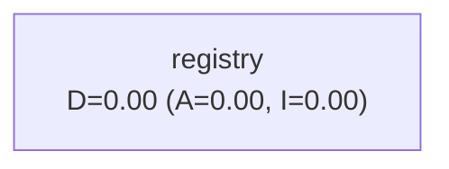

# EventBob Registry Dependency Graph

Package dependencies with Martin Metrics:
- **A** (Abstractedness): ratio of abstract classes to total classes
- **I** (Instability): ratio of outgoing to total dependencies
- **D** (Distance): |A + I - 1| (distance from ideal line)

Ideal packages are either:
- Abstract and stable (A=1, I=0) - pure abstractions/ports
- Concrete and unstable (A=0, I=1) - pure implementations

*Generated by RegistryArchitectureTest.generateMermaidDependencyGraph().*
*Do not modify this file directly.*

